# MAS Graph Template Gallery - Agent Readable

This file is designed for AI agents working on `gaofeng21cn/med-autoscience`. It pairs each reusable medical-research plot template with a rendered reference image, executable R code, data contract, source-project provenance, and the closest existing med-autoscience display-pack concept.

## Global visual contract

- Palette: primary `#245A6B`, neutral `#13293D`, secondary/audit `#8B3A3A`, accent `#D8A24A`, light background `#EEF4F7`.
- Default non-exempt plot panel: square 4.8 x 4.8 inches, 320 dpi PNG plus PDF export.
- Aspect policy: non-exempt templates use a 1:1 coordinate panel; heatmap/matrix/long-bar/table/image/composite templates keep readable free aspect.
- Lines: main curves 0.9 pt; reference lines 0.45-0.55 pt; tile borders 0.4-0.55 pt.
- Text: base size 11; bold neutral titles; legends at bottom unless table/image layouts require otherwise.
- Data boundary: all reference figures use synthetic data. Source paths document provenance only and must not be treated as reusable patient-level data.

## Source inventory summary

- Indexed plot-related source files: **485**
- Project 1: **357**
- Project 2: **128**
- Full inventory: `audit/source_inventory.csv` and `audit/source_inventory.json` in this asset bundle.

## Kaplan-Meier survival with risk table

- Template ID: `survival_km`
- Category: `survival_km` / Survival / Kaplan-Meier
- med-autoscience mapping: `kaplan_meier_grouped`
- Data contract: `time`, `survival`, `group`, `n_risk`
- Axis aspect policy: `square_axis_panel`

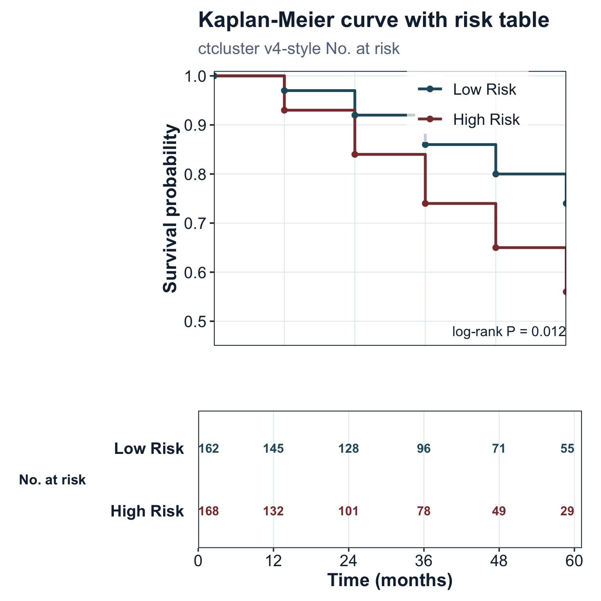

### Representative source files

- `/Volumes/七号/课题补充分析和写作/03出图/Figure 1/s.f1-分层分析.Rmd` (primary, score=633)
- `/Users/qihaoning/00工作/202603CTcluster/code_ref/current_article_templates/Main_Fig1_KM_Multicox_Binary/s.f1-分层分析.Rmd` (primary, score=633)
- `/Users/qihaoning/00工作/202603CTcluster/code_ref/current_article_templates/Main_Fig1_KM_Multicox_Ternary/s.f1-分层分析.Rmd` (primary, score=633)
- `/Volumes/七号/课题补充分析和写作/03出图/Figure 7/f7-免疫治疗队列分析.Rmd` (primary, score=435)
- `/Users/qihaoning/00工作/202603CTcluster/code_ref/current_article_templates/Main_Fig5_TIDE_IPS/f7-免疫治疗队列分析.Rmd` (primary, score=435)

### Reference code

```r
suppressPackageStartupMessages({library(ggplot2); library(jsonlite); library(patchwork); library(scales); library(dplyr)})
args_all <- commandArgs(FALSE)
file_arg <- args_all[grepl("^--file=", args_all)]
this_file <- if (length(file_arg)) sub("^--file=", "", file_arg[[1]]) else normalizePath(".")
template_dir <- dirname(normalizePath(this_file))
shared_theme <- file.path(dirname(template_dir), "_shared", "mas_theme.R")
source(shared_theme)
`%||%` <- function(x, y) if (is.null(x)) y else x
make_example_data <- function() {
  times <- c(0, 12, 24, 36, 48, 60)
  curves <- rbind(
    data.frame(time = times, survival = c(1, .93, .84, .74, .65, .56), group = "High Risk"),
    data.frame(time = times, survival = c(1, .97, .92, .86, .80, .74), group = "Low Risk")
  )
  risk_table <- rbind(
    data.frame(time = times, n_risk = c(168, 132, 101, 78, 49, 29), group = "High Risk"),
    data.frame(time = times, n_risk = c(162, 145, 128, 96, 71, 55), group = "Low Risk")
  )
  list(curves = curves, risk_table = risk_table)
}
risk_table_df <- function(risk_table, times = seq(0, 60, 12)) {
  risk_table$time <- as.numeric(risk_table$time)
  risk_table$group <- factor(risk_table$group, levels = c("High Risk", "Low Risk"))
  risk_table |>
    filter(time %in% times) |>
    mutate(hjust = case_when(time <= min(times) ~ 0, time >= max(times) ~ 1, TRUE ~ 0.5))
}
make_plot <- function(data = make_example_data()) {
  times <- seq(0, 60, 12)
  curve_df <- data$curves
  curve_df$group <- factor(curve_df$group, levels = c("Low Risk", "High Risk"))
  risk_df <- risk_table_df(data$risk_table, times)
  p_curve <- ggplot(curve_df, aes(time, survival, colour = group)) +
    geom_step(linewidth = 0.75, direction = "hv") +
    geom_point(size = 1.25) +
    annotate("text", x = 60, y = .48, hjust = 1, label = "log-rank P = 0.012", colour = mas_palette$neutral, size = 2.8) +
    scale_colour_manual(values = c("Low Risk" = mas_palette$primary, "High Risk" = mas_palette$secondary)) +
    scale_x_continuous(breaks = times, limits = c(0, 60), expand = c(0, 0)) +
    scale_y_continuous(limits = c(.45, 1.01), breaks = seq(.5, 1, .1), expand = c(0, 0)) +
    labs(title = "Kaplan-Meier curve with risk table", subtitle = "ctcluster v4-style No. at risk", x = NULL, y = "Survival probability") +
    mas_theme(base_size = 9.5) +
    theme(
      aspect.ratio = .78,
      legend.position = c(.72, .88),
      legend.background = element_rect(fill = scales::alpha("white", .72), colour = NA),
      axis.text.x = element_blank(),
      axis.ticks.x = element_blank(),
      axis.title.x = element_blank(),
      plot.margin = margin(1, 2, 0, 2)
    )
  p_risk <- ggplot(risk_df, aes(time, group)) +
    geom_text(aes(label = n_risk, colour = group, hjust = hjust), size = 2.55, fontface = "bold") +
    scale_colour_manual(values = c("Low Risk" = mas_palette$primary, "High Risk" = mas_palette$secondary)) +
    scale_x_continuous(breaks = times, limits = c(0, 60), expand = expansion(mult = c(0, .02))) +
    labs(x = "Time (months)", y = "No. at risk") +
    mas_theme(base_size = 8.2) +
    theme(
      legend.position = "none",
      panel.grid.major.y = element_blank(),
      panel.grid.minor = element_blank(),
      axis.title.y = element_text(size = 8, angle = 0, vjust = .5, margin = margin(r = 14)),
      axis.text.y = element_text(face = "bold", colour = mas_palette$neutral, margin = margin(r = 8)),
      axis.ticks.y = element_blank(),
      plot.title = element_blank(),
      plot.subtitle = element_blank(),
      plot.margin = margin(0, 2, 1, 2)
    )
  p_curve / patchwork::plot_spacer() / p_risk + patchwork::plot_layout(heights = c(0.60, 0.10, 0.30))
}
if (sys.nframe() == 0) save_mas_plot(make_plot(), commandArgs(TRUE)[1] %||% "figures", "survival_km", width = 4.8, height = 4.8)

```

## Cumulative incidence curve

- Template ID: `cumulative_incidence_grouped`
- Category: `survival_km` / Survival / Kaplan-Meier
- med-autoscience mapping: `cumulative_incidence_grouped`
- Data contract: `time`, `incidence`, `group`
- Axis aspect policy: `square_axis_panel`

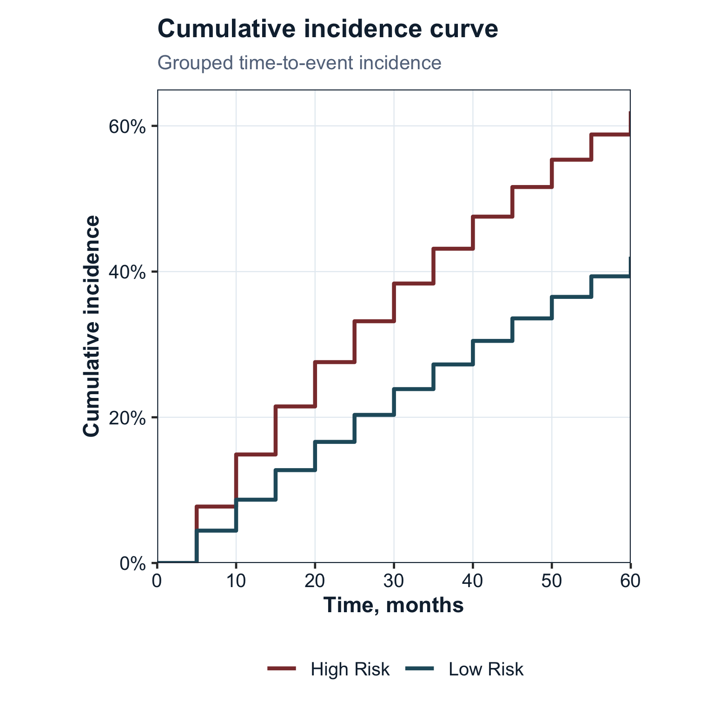

### Representative source files

- `/Volumes/七号/课题补充分析和写作/03出图/Figure 1/s.f1-分层分析.Rmd` (primary, score=633)
- `/Users/qihaoning/00工作/202603CTcluster/code_ref/current_article_templates/Main_Fig1_KM_Multicox_Binary/s.f1-分层分析.Rmd` (primary, score=633)
- `/Users/qihaoning/00工作/202603CTcluster/code_ref/current_article_templates/Main_Fig1_KM_Multicox_Ternary/s.f1-分层分析.Rmd` (primary, score=633)
- `/Volumes/七号/课题补充分析和写作/03出图/Figure 7/f7-免疫治疗队列分析.Rmd` (primary, score=435)
- `/Users/qihaoning/00工作/202603CTcluster/code_ref/current_article_templates/Main_Fig5_TIDE_IPS/f7-免疫治疗队列分析.Rmd` (primary, score=435)

### Reference code

```r
suppressPackageStartupMessages({library(ggplot2); library(jsonlite)})
args_all <- commandArgs(FALSE)
file_arg <- args_all[grepl("^--file=", args_all)]
this_file <- if (length(file_arg)) sub("^--file=", "", file_arg[[1]]) else normalizePath(".")
template_dir <- dirname(normalizePath(this_file))
shared_theme <- file.path(dirname(template_dir), "_shared", "mas_theme.R")
source(shared_theme)
`%||%` <- function(x, y) if (is.null(x)) y else x
make_example_data <- function() {
  t <- seq(0, 60, by = 5)
  rbind(
    data.frame(time = t, incidence = 1 - exp(-t/62), group = "High Risk"),
    data.frame(time = t, incidence = 1 - exp(-t/110), group = "Low Risk")
  )
}
make_plot <- function(data = make_example_data()) {
  ggplot(data, aes(time, incidence, colour = group)) +
    geom_step(linewidth = .9, direction = "hv") +
    scale_colour_manual(values = c("Low Risk" = mas_palette$primary, "High Risk" = mas_palette$secondary)) +
    scale_x_continuous(breaks = seq(0, 60, 10), limits = c(0,60), expand = c(0,0)) +
    scale_y_continuous(limits = c(0,.65), labels = function(x) paste0(round(x*100), "%"), expand = c(0,0)) +
    labs(title = "Cumulative incidence curve", subtitle = "Grouped time-to-event incidence", x = "Time, months", y = "Cumulative incidence") +
    mas_theme() + theme(aspect.ratio = 1)
}
if (sys.nframe() == 0) save_mas_plot(make_plot(), commandArgs(TRUE)[1] %||% "figures", "cumulative_incidence_grouped", width = 4.8, height = 4.8)

```

## ROC curve with model comparison

- Template ID: `roc_auc`
- Category: `roc_auc` / ROC / AUC
- med-autoscience mapping: `roc_curve_binary / time_dependent_roc_horizon`
- Data contract: `fpr`, `tpr`, `model`, `auc`
- Axis aspect policy: `square_axis_panel`

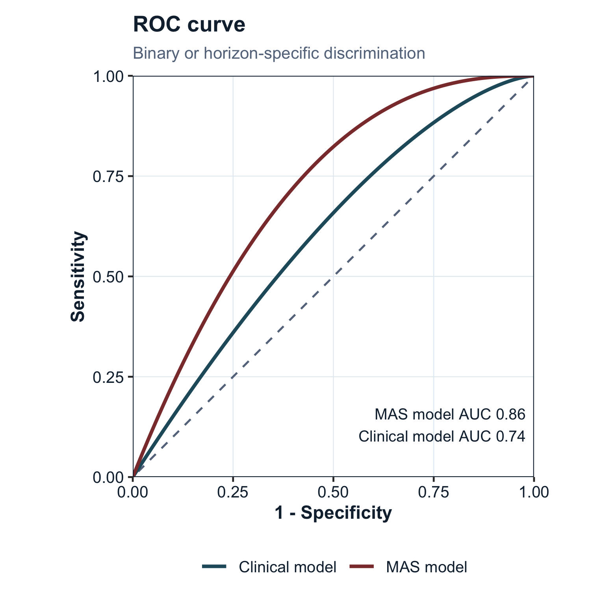

### Representative source files

- `/Volumes/七号/课题补充分析和写作/03出图/Figure 7/f7-免疫治疗队列分析.Rmd` (primary, score=435)
- `/Users/qihaoning/00工作/202603CTcluster/code_ref/current_article_templates/Main_Fig5_TIDE_IPS/f7-免疫治疗队列分析.Rmd` (primary, score=435)
- `/Users/qihaoning/00工作/202603CTcluster/official_mainline_clean_v1/code/omics_pipeline/joint_binary_manuscript_figures_v2/server_gradcam_sysu6h.py` (primary, score=315)
- `/Volumes/七号/课题补充分析和写作/03出图/Figure 5/f5c-生存分析(贝伐使用os).Rmd` (primary, score=314)
- `/Users/qihaoning/00工作/202603CTcluster/official_mainline_clean_v1/code/omics_pipeline/joint_binary_manuscript_figures_v2/export_risk_output_roi_gradcam.py` (primary, score=305)

### Reference code

```r
suppressPackageStartupMessages({library(ggplot2); library(jsonlite)})
args_all <- commandArgs(FALSE)
file_arg <- args_all[grepl("^--file=", args_all)]
this_file <- if (length(file_arg)) sub("^--file=", "", file_arg[[1]]) else normalizePath(".")
template_dir <- dirname(normalizePath(this_file))
shared_theme <- file.path(dirname(template_dir), "_shared", "mas_theme.R")
source(shared_theme)
`%||%` <- function(x, y) if (is.null(x)) y else x
make_example_data <- function() {
  x <- seq(0, 1, length.out = 80)
  rbind(
    data.frame(fpr = x, tpr = 1 - (1 - x)^2.5, model = "MAS model", auc = "AUC 0.86"),
    data.frame(fpr = x, tpr = 1 - (1 - x)^1.55, model = "Clinical model", auc = "AUC 0.74")
  )
}
make_plot <- function(data = make_example_data()) {
  ggplot(data, aes(fpr, tpr, colour = model)) +
    geom_abline(slope = 1, intercept = 0, linetype = "dashed", linewidth = 0.55, colour = mas_palette$muted) +
    geom_line(linewidth = 0.95) +
    scale_colour_manual(values = mas_discrete[1:2]) +
    coord_equal(xlim = c(0, 1), ylim = c(0, 1), expand = FALSE) +
    labs(title = "ROC curve", subtitle = "Binary or horizon-specific discrimination", x = "1 - Specificity", y = "Sensitivity") +
    annotate("text", x = .98, y = .13, hjust = 1, label = "MAS model AUC 0.86
Clinical model AUC 0.74", size = 3.1, colour = mas_palette$neutral) +
    mas_theme()
}
if (sys.nframe() == 0) save_mas_plot(make_plot(), commandArgs(TRUE)[1] %||% "figures", "roc_auc", width = 4.8, height = 4.8)

```

## Time-dependent ROC horizon

- Template ID: `time_dependent_roc_horizon`
- Category: `roc_auc` / ROC / AUC
- med-autoscience mapping: `time_dependent_roc_horizon`
- Data contract: `time`, `event`, `score`, `horizon`, `auc`
- Axis aspect policy: `square_axis_panel`

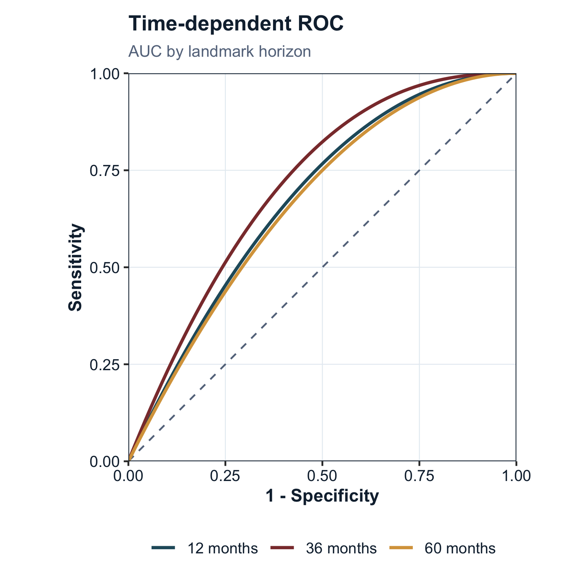

### Representative source files

- `/Volumes/七号/课题补充分析和写作/03出图/Figure 7/f7-免疫治疗队列分析.Rmd` (primary, score=435)
- `/Users/qihaoning/00工作/202603CTcluster/code_ref/current_article_templates/Main_Fig5_TIDE_IPS/f7-免疫治疗队列分析.Rmd` (primary, score=435)
- `/Users/qihaoning/00工作/202603CTcluster/official_mainline_clean_v1/code/omics_pipeline/joint_binary_manuscript_figures_v2/server_gradcam_sysu6h.py` (primary, score=315)
- `/Volumes/七号/课题补充分析和写作/03出图/Figure 5/f5c-生存分析(贝伐使用os).Rmd` (primary, score=314)
- `/Users/qihaoning/00工作/202603CTcluster/official_mainline_clean_v1/code/omics_pipeline/joint_binary_manuscript_figures_v2/export_risk_output_roi_gradcam.py` (primary, score=305)

### Reference code

```r
suppressPackageStartupMessages({library(ggplot2); library(jsonlite)})
args_all <- commandArgs(FALSE)
file_arg <- args_all[grepl("^--file=", args_all)]
this_file <- if (length(file_arg)) sub("^--file=", "", file_arg[[1]]) else normalizePath(".")
template_dir <- dirname(normalizePath(this_file))
shared_theme <- file.path(dirname(template_dir), "_shared", "mas_theme.R")
source(shared_theme)
`%||%` <- function(x, y) if (is.null(x)) y else x
make_example_data <- function() {
  fpr <- seq(0,1,length.out=70)
  rbind(
    data.frame(fpr=fpr, tpr=1-(1-fpr)^2.1, horizon="12 months"),
    data.frame(fpr=fpr, tpr=1-(1-fpr)^2.5, horizon="36 months"),
    data.frame(fpr=fpr, tpr=1-(1-fpr)^2.0, horizon="60 months")
  )
}
make_plot <- function(data = make_example_data()) {
  ggplot(data, aes(fpr, tpr, colour = horizon)) + geom_abline(slope=1, intercept=0, linetype="dashed", colour=mas_palette$muted, linewidth=.5) + geom_line(linewidth=.9) + scale_colour_manual(values=mas_discrete[1:3]) + coord_equal(xlim=c(0,1), ylim=c(0,1), expand=FALSE) + labs(title="Time-dependent ROC", subtitle="AUC by landmark horizon", x="1 - Specificity", y="Sensitivity") + mas_theme()
}
if (sys.nframe() == 0) save_mas_plot(make_plot(), commandArgs(TRUE)[1] %||% "figures", "time_dependent_roc_horizon", width = 4.8, height = 4.8)

```

## Calibration curve (binary outcome)

- Template ID: `calibration_curve_binary`
- Category: `roc_auc` / ROC / AUC
- med-autoscience mapping: `calibration_curve_binary`
- Data contract: `predicted`, `observed`, `lower`, `upper`
- Axis aspect policy: `square_axis_panel`

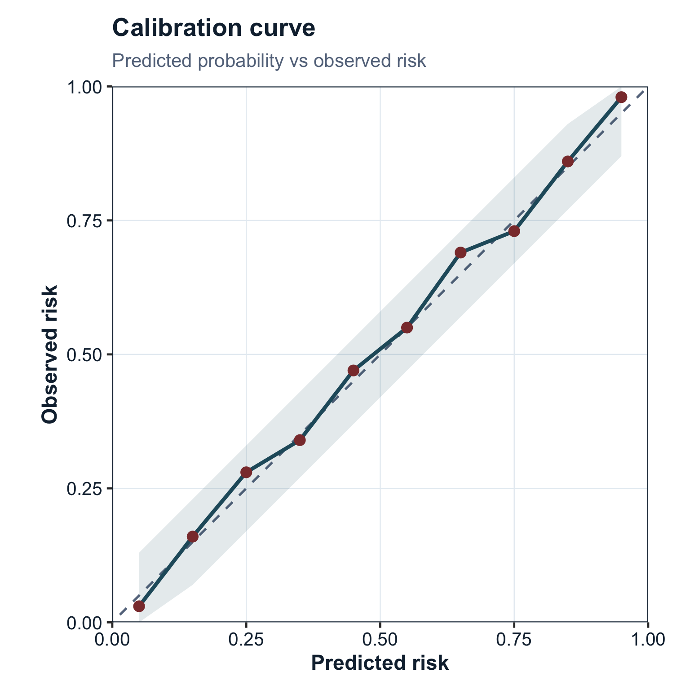

### Representative source files

- `/Volumes/七号/课题补充分析和写作/03出图/Figure 7/f7-免疫治疗队列分析.Rmd` (primary, score=435)
- `/Users/qihaoning/00工作/202603CTcluster/code_ref/current_article_templates/Main_Fig5_TIDE_IPS/f7-免疫治疗队列分析.Rmd` (primary, score=435)
- `/Users/qihaoning/00工作/202603CTcluster/official_mainline_clean_v1/code/omics_pipeline/joint_binary_manuscript_figures_v2/server_gradcam_sysu6h.py` (primary, score=315)
- `/Volumes/七号/课题补充分析和写作/03出图/Figure 5/f5c-生存分析(贝伐使用os).Rmd` (primary, score=314)
- `/Users/qihaoning/00工作/202603CTcluster/official_mainline_clean_v1/code/omics_pipeline/joint_binary_manuscript_figures_v2/export_risk_output_roi_gradcam.py` (primary, score=305)

### Reference code

```r
suppressPackageStartupMessages({library(ggplot2); library(jsonlite)})
args_all <- commandArgs(FALSE)
file_arg <- args_all[grepl("^--file=", args_all)]
this_file <- if (length(file_arg)) sub("^--file=", "", file_arg[[1]]) else normalizePath(".")
template_dir <- dirname(normalizePath(this_file))
shared_theme <- file.path(dirname(template_dir), "_shared", "mas_theme.R")
source(shared_theme)
`%||%` <- function(x, y) if (is.null(x)) y else x
make_example_data <- function() {
  pred <- seq(.05, .95, length.out = 10)
  data.frame(predicted = pred, observed = pmin(pmax(pred + c(-.02,.01,.03,-.01,.02,.00,.04,-.02,.01,.03), 0), 1), lower = pmax(pred - .08, 0), upper = pmin(pred + .08, 1))
}
make_plot <- function(data = make_example_data()) {
  ggplot(data, aes(predicted, observed)) +
    geom_abline(slope = 1, intercept = 0, linetype = "dashed", linewidth = .55, colour = mas_palette$muted) +
    geom_ribbon(aes(ymin = lower, ymax = upper), fill = mas_palette$primary, alpha = .12) +
    geom_line(linewidth = .9, colour = mas_palette$primary) +
    geom_point(size = 2.1, colour = mas_palette$secondary) +
    coord_equal(xlim = c(0, 1), ylim = c(0, 1), expand = FALSE) +
    labs(title = "Calibration curve", subtitle = "Predicted probability vs observed risk", x = "Predicted risk", y = "Observed risk") +
    mas_theme()
}
if (sys.nframe() == 0) save_mas_plot(make_plot(), commandArgs(TRUE)[1] %||% "figures", "calibration_curve_binary", width = 4.8, height = 4.8)

```

## Precision-recall curve

- Template ID: `pr_curve_binary`
- Category: `roc_auc` / ROC / AUC
- med-autoscience mapping: `pr_curve_binary`
- Data contract: `recall`, `precision`, `model`
- Axis aspect policy: `square_axis_panel`

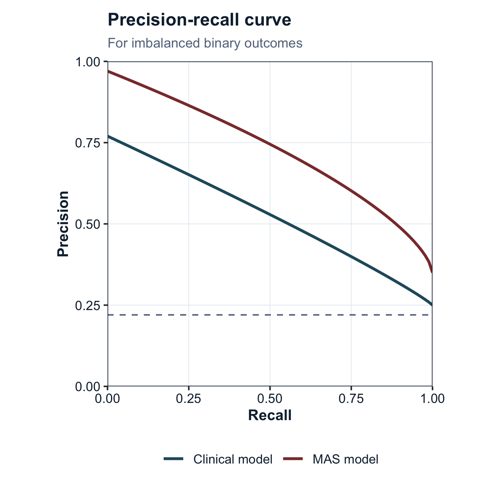

### Representative source files

- `/Volumes/七号/课题补充分析和写作/03出图/Figure 7/f7-免疫治疗队列分析.Rmd` (primary, score=435)
- `/Users/qihaoning/00工作/202603CTcluster/code_ref/current_article_templates/Main_Fig5_TIDE_IPS/f7-免疫治疗队列分析.Rmd` (primary, score=435)
- `/Users/qihaoning/00工作/202603CTcluster/official_mainline_clean_v1/code/omics_pipeline/joint_binary_manuscript_figures_v2/server_gradcam_sysu6h.py` (primary, score=315)
- `/Volumes/七号/课题补充分析和写作/03出图/Figure 5/f5c-生存分析(贝伐使用os).Rmd` (primary, score=314)
- `/Users/qihaoning/00工作/202603CTcluster/official_mainline_clean_v1/code/omics_pipeline/joint_binary_manuscript_figures_v2/export_risk_output_roi_gradcam.py` (primary, score=305)

### Reference code

```r
suppressPackageStartupMessages({library(ggplot2); library(jsonlite)})
args_all <- commandArgs(FALSE)
file_arg <- args_all[grepl("^--file=", args_all)]
this_file <- if (length(file_arg)) sub("^--file=", "", file_arg[[1]]) else normalizePath(".")
template_dir <- dirname(normalizePath(this_file))
shared_theme <- file.path(dirname(template_dir), "_shared", "mas_theme.R")
source(shared_theme)
`%||%` <- function(x, y) if (is.null(x)) y else x
make_example_data <- function() {
  recall <- seq(0, 1, length.out = 90)
  rbind(
    data.frame(recall = recall, precision = .35 + .62 * (1 - recall)^.65, model = "MAS model"),
    data.frame(recall = recall, precision = .25 + .52 * (1 - recall)^.90, model = "Clinical model")
  )
}
make_plot <- function(data = make_example_data()) {
  ggplot(data, aes(recall, precision, colour = model)) +
    geom_hline(yintercept = .22, linetype = "dashed", linewidth = .5, colour = mas_palette$muted) +
    geom_line(linewidth = .95) +
    scale_colour_manual(values = mas_discrete[1:2]) +
    coord_equal(xlim = c(0,1), ylim = c(0,1), expand = FALSE) +
    labs(title = "Precision-recall curve", subtitle = "For imbalanced binary outcomes", x = "Recall", y = "Precision") +
    mas_theme()
}
if (sys.nframe() == 0) save_mas_plot(make_plot(), commandArgs(TRUE)[1] %||% "figures", "pr_curve_binary", width = 4.8, height = 4.8)

```

## Decision curve (binary outcome)

- Template ID: `decision_curve_binary`
- Category: `roc_auc` / ROC / AUC
- med-autoscience mapping: `decision_curve_binary`
- Data contract: `threshold`, `net_benefit`, `strategy`
- Axis aspect policy: `square_axis_panel`

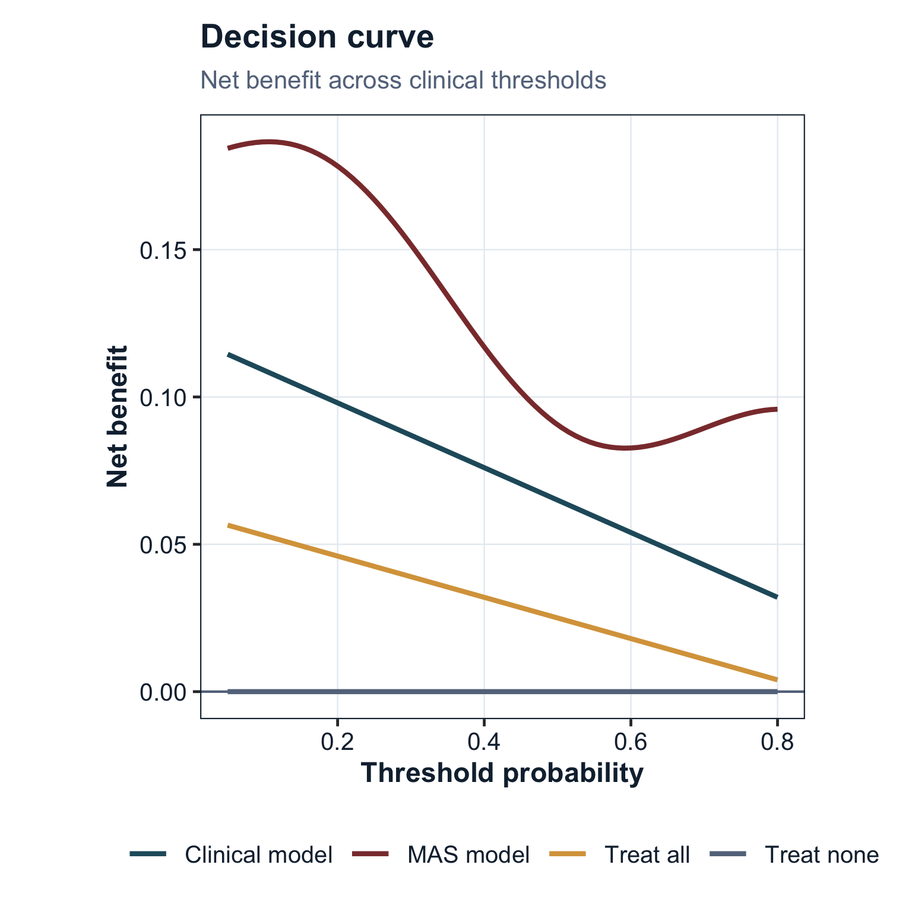

### Representative source files

- `/Volumes/七号/课题补充分析和写作/03出图/Figure 7/f7-免疫治疗队列分析.Rmd` (primary, score=435)
- `/Users/qihaoning/00工作/202603CTcluster/code_ref/current_article_templates/Main_Fig5_TIDE_IPS/f7-免疫治疗队列分析.Rmd` (primary, score=435)
- `/Users/qihaoning/00工作/202603CTcluster/official_mainline_clean_v1/code/omics_pipeline/joint_binary_manuscript_figures_v2/server_gradcam_sysu6h.py` (primary, score=315)
- `/Volumes/七号/课题补充分析和写作/03出图/Figure 5/f5c-生存分析(贝伐使用os).Rmd` (primary, score=314)
- `/Users/qihaoning/00工作/202603CTcluster/official_mainline_clean_v1/code/omics_pipeline/joint_binary_manuscript_figures_v2/export_risk_output_roi_gradcam.py` (primary, score=305)

### Reference code

```r
suppressPackageStartupMessages({library(ggplot2); library(jsonlite)})
args_all <- commandArgs(FALSE)
file_arg <- args_all[grepl("^--file=", args_all)]
this_file <- if (length(file_arg)) sub("^--file=", "", file_arg[[1]]) else normalizePath(".")
template_dir <- dirname(normalizePath(this_file))
shared_theme <- file.path(dirname(template_dir), "_shared", "mas_theme.R")
source(shared_theme)
`%||%` <- function(x, y) if (is.null(x)) y else x
make_example_data <- function() {
  t <- seq(.05, .80, length.out = 80)
  rbind(
    data.frame(threshold = t, net_benefit = .18 - .13 * t + .025 * sin(t * 9), strategy = "MAS model"),
    data.frame(threshold = t, net_benefit = .12 - .11 * t, strategy = "Clinical model"),
    data.frame(threshold = t, net_benefit = .06 - .07 * t, strategy = "Treat all"),
    data.frame(threshold = t, net_benefit = 0, strategy = "Treat none")
  )
}
make_plot <- function(data = make_example_data()) {
  ggplot(data, aes(threshold, net_benefit, colour = strategy)) +
    geom_hline(yintercept = 0, linewidth = .45, colour = mas_palette$muted) +
    geom_line(linewidth = .9) +
    scale_colour_manual(values = c(mas_palette$primary, mas_palette$secondary, mas_palette$accent, mas_palette$muted)) +
    labs(title = "Decision curve", subtitle = "Net benefit across clinical thresholds", x = "Threshold probability", y = "Net benefit") +
    mas_theme() + theme(aspect.ratio = 1)
}
if (sys.nframe() == 0) save_mas_plot(make_plot(), commandArgs(TRUE)[1] %||% "figures", "decision_curve_binary", width = 4.8, height = 4.8)

```

## Decision curve (time-to-event horizon)

- Template ID: `time_to_event_decision_curve`
- Category: `roc_auc` / ROC / AUC
- med-autoscience mapping: `time_to_event_decision_curve`
- Data contract: `threshold`, `net_benefit`, `strategy`, `horizon`
- Axis aspect policy: `square_axis_panel`


### Representative source files

- `/Volumes/七号/课题补充分析和写作/03出图/Figure 7/f7-免疫治疗队列分析.Rmd` (primary, score=435)
- `/Users/qihaoning/00工作/202603CTcluster/code_ref/current_article_templates/Main_Fig5_TIDE_IPS/f7-免疫治疗队列分析.Rmd` (primary, score=435)
- `/Users/qihaoning/00工作/202603CTcluster/official_mainline_clean_v1/code/omics_pipeline/joint_binary_manuscript_figures_v2/server_gradcam_sysu6h.py` (primary, score=315)
- `/Volumes/七号/课题补充分析和写作/03出图/Figure 5/f5c-生存分析(贝伐使用os).Rmd` (primary, score=314)
- `/Users/qihaoning/00工作/202603CTcluster/official_mainline_clean_v1/code/omics_pipeline/joint_binary_manuscript_figures_v2/export_risk_output_roi_gradcam.py` (primary, score=305)

### Reference code

```r
suppressPackageStartupMessages({library(ggplot2); library(jsonlite)})
args_all <- commandArgs(FALSE)
file_arg <- args_all[grepl("^--file=", args_all)]
this_file <- if (length(file_arg)) sub("^--file=", "", file_arg[[1]]) else normalizePath(".")
template_dir <- dirname(normalizePath(this_file))
shared_theme <- file.path(dirname(template_dir), "_shared", "mas_theme.R")
source(shared_theme)
`%||%` <- function(x, y) if (is.null(x)) y else x
make_example_data <- function() {
  t <- seq(.05, .80, length.out = 80)
  rbind(
    data.frame(threshold = t, net_benefit = .18 - .13 * t + .025 * sin(t * 9), strategy = "MAS model"),
    data.frame(threshold = t, net_benefit = .12 - .11 * t, strategy = "Clinical model"),
    data.frame(threshold = t, net_benefit = .06 - .07 * t, strategy = "Treat all"),
    data.frame(threshold = t, net_benefit = 0, strategy = "Treat none")
  )
}
make_plot <- function(data = make_example_data()) {
  ggplot(data, aes(threshold, net_benefit, colour = strategy)) +
    geom_hline(yintercept = 0, linewidth = .45, colour = mas_palette$muted) +
    geom_line(linewidth = .9) +
    scale_colour_manual(values = c(mas_palette$primary, mas_palette$secondary, mas_palette$accent, mas_palette$muted)) +
    labs(title = "Decision curve", subtitle = "Net benefit across clinical thresholds", x = "Threshold probability", y = "Net benefit") +
    mas_theme() + theme(aspect.ratio = 1)
}
if (sys.nframe() == 0) save_mas_plot(make_plot(), commandArgs(TRUE)[1] %||% "figures", "time_to_event_decision_curve", width = 4.8, height = 4.8)

```

## Multi-horizon calibration panel

- Template ID: `time_to_event_multihorizon_calibration_panel`
- Category: `roc_auc` / ROC / AUC
- med-autoscience mapping: `time_to_event_multihorizon_calibration_panel`
- Data contract: `predicted`, `observed`, `horizon`
- Axis aspect policy: `square_axis_panel`

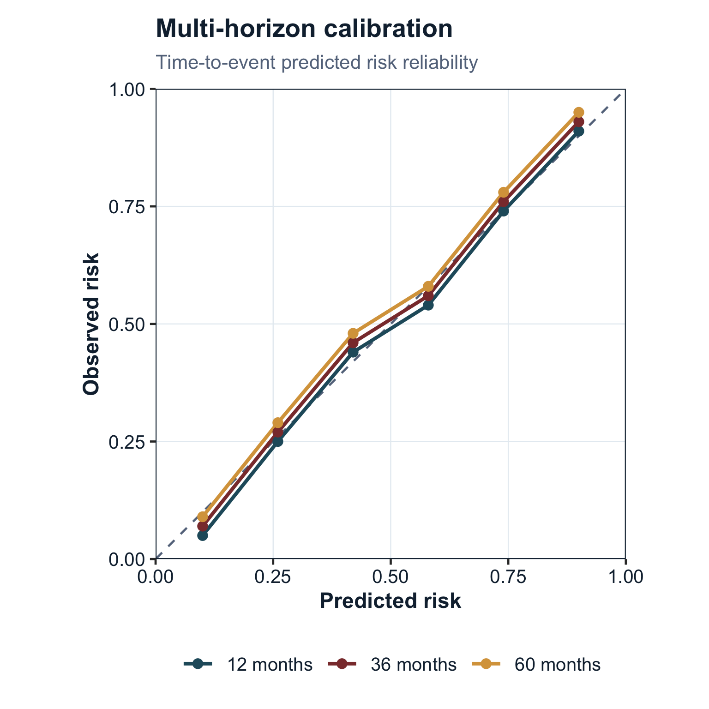

### Representative source files

- `/Volumes/七号/课题补充分析和写作/03出图/Figure 7/f7-免疫治疗队列分析.Rmd` (primary, score=435)
- `/Users/qihaoning/00工作/202603CTcluster/code_ref/current_article_templates/Main_Fig5_TIDE_IPS/f7-免疫治疗队列分析.Rmd` (primary, score=435)
- `/Users/qihaoning/00工作/202603CTcluster/official_mainline_clean_v1/code/omics_pipeline/joint_binary_manuscript_figures_v2/server_gradcam_sysu6h.py` (primary, score=315)
- `/Volumes/七号/课题补充分析和写作/03出图/Figure 5/f5c-生存分析(贝伐使用os).Rmd` (primary, score=314)
- `/Users/qihaoning/00工作/202603CTcluster/official_mainline_clean_v1/code/omics_pipeline/joint_binary_manuscript_figures_v2/export_risk_output_roi_gradcam.py` (primary, score=305)

### Reference code

```r
suppressPackageStartupMessages({library(ggplot2); library(jsonlite)})
args_all <- commandArgs(FALSE)
file_arg <- args_all[grepl("^--file=", args_all)]
this_file <- if (length(file_arg)) sub("^--file=", "", file_arg[[1]]) else normalizePath(".")
template_dir <- dirname(normalizePath(this_file))
shared_theme <- file.path(dirname(template_dir), "_shared", "mas_theme.R")
source(shared_theme)
`%||%` <- function(x, y) if (is.null(x)) y else x
make_example_data <- function() {
  pred <- rep(seq(.1,.9,length.out=6), 3)
  horizon <- rep(c("12 months", "36 months", "60 months"), each=6)
  observed <- pred + rep(c(-.03,.01,.04,-.02,.02,.03), 3) + rep(c(-.02,0,.02), each=6)
  data.frame(predicted=pred, observed=pmin(pmax(observed,0),1), horizon=horizon)
}
make_plot <- function(data = make_example_data()) {
  ggplot(data, aes(predicted, observed, colour=horizon)) + geom_abline(slope=1, intercept=0, linetype="dashed", colour=mas_palette$muted, linewidth=.5) + geom_line(linewidth=.82) + geom_point(size=1.8) + scale_colour_manual(values=mas_discrete[1:3]) + coord_equal(xlim=c(0,1), ylim=c(0,1), expand=FALSE) + labs(title="Multi-horizon calibration", subtitle="Time-to-event predicted risk reliability", x="Predicted risk", y="Observed risk") + mas_theme()
}
if (sys.nframe() == 0) save_mas_plot(make_plot(), commandArgs(TRUE)[1] %||% "figures", "time_to_event_multihorizon_calibration_panel", width = 4.8, height = 4.8)

```

## Cox/effect forest plot

- Template ID: `forest_cox`
- Category: `forest_cox` / Forest / Cox model
- med-autoscience mapping: `forest_effect_main / multivariable_forest`
- Data contract: `term`, `estimate`, `lower`, `upper`, `p_value`
- Axis aspect policy: `square_axis_panel`

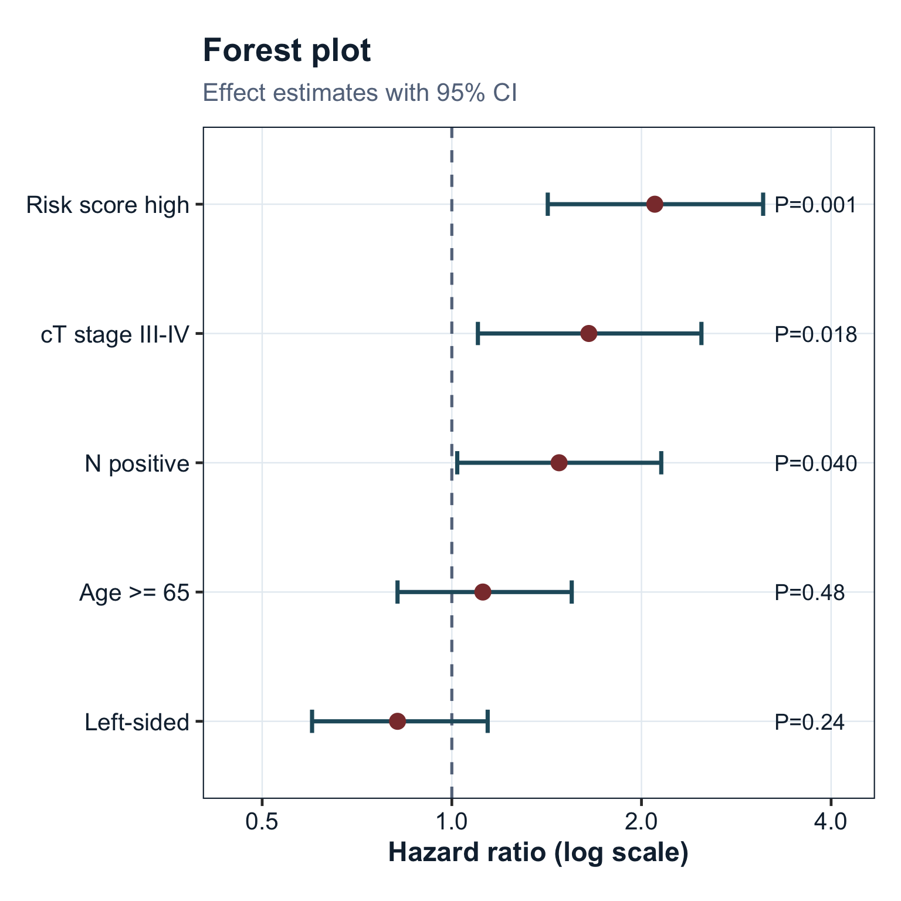

### Representative source files

- `/Volumes/七号/课题补充分析和写作/03出图/Figure 1/s.f1-分层分析.Rmd` (primary, score=633)
- `/Users/qihaoning/00工作/202603CTcluster/code_ref/current_article_templates/Main_Fig1_KM_Multicox_Binary/s.f1-分层分析.Rmd` (primary, score=633)
- `/Users/qihaoning/00工作/202603CTcluster/code_ref/current_article_templates/Main_Fig1_KM_Multicox_Ternary/s.f1-分层分析.Rmd` (primary, score=633)
- `/Users/qihaoning/00工作/202603CTcluster/official_mainline_clean_v1/code/omics_pipeline/joint_binary_manuscript_figures_v2/render_figure4_biology_v2.R` (primary, score=592)
- `/Volumes/七号/课题补充分析和写作/03出图/Figure 7/f7-免疫治疗队列分析.Rmd` (primary, score=435)

### Reference code

```r
suppressPackageStartupMessages({library(ggplot2); library(jsonlite)})
args_all <- commandArgs(FALSE)
file_arg <- args_all[grepl("^--file=", args_all)]
this_file <- if (length(file_arg)) sub("^--file=", "", file_arg[[1]]) else normalizePath(".")
template_dir <- dirname(normalizePath(this_file))
shared_theme <- file.path(dirname(template_dir), "_shared", "mas_theme.R")
source(shared_theme)
`%||%` <- function(x, y) if (is.null(x)) y else x
make_example_data <- function() {
  data.frame(term = factor(c("Risk score high", "cT stage III-IV", "N positive", "Age >= 65", "Left-sided"), levels = rev(c("Risk score high", "cT stage III-IV", "N positive", "Age >= 65", "Left-sided"))), estimate = c(2.10, 1.65, 1.48, 1.12, 0.82), lower = c(1.42, 1.10, 1.02, 0.82, 0.60), upper = c(3.12, 2.49, 2.15, 1.55, 1.14), p = c("0.001", "0.018", "0.040", "0.48", "0.24"))
}
make_plot <- function(data = make_example_data()) {
  ggplot(data, aes(estimate, term)) + geom_vline(xintercept = 1, linetype = "dashed", linewidth = 0.55, colour = mas_palette$muted) + geom_errorbar(aes(xmin = lower, xmax = upper), orientation = "y", width = 0.18, linewidth = 0.75, colour = mas_palette$primary) + geom_point(size = 2.4, colour = mas_palette$secondary) + geom_text(aes(label = paste0("P=", p), x = 3.25), hjust = 0, size = 3.0, colour = mas_palette$neutral) + scale_x_log10(limits = c(0.45, 4.2), breaks = c(.5, 1, 2, 4)) + labs(title = "Forest plot", subtitle = "Effect estimates with 95% CI", x = "Hazard ratio (log scale)", y = NULL) + mas_theme() + theme(aspect.ratio = 1)
}
if (sys.nframe() == 0) save_mas_plot(make_plot(), commandArgs(TRUE)[1] %||% "figures", "forest_cox", width = 4.8, height = 4.8)

```

## Coefficient path panel

- Template ID: `coefficient_path_panel`
- Category: `forest_cox` / Forest / Cox model
- med-autoscience mapping: `coefficient_path_panel`
- Data contract: `lambda`, `feature`, `coefficient`
- Axis aspect policy: `square_axis_panel`

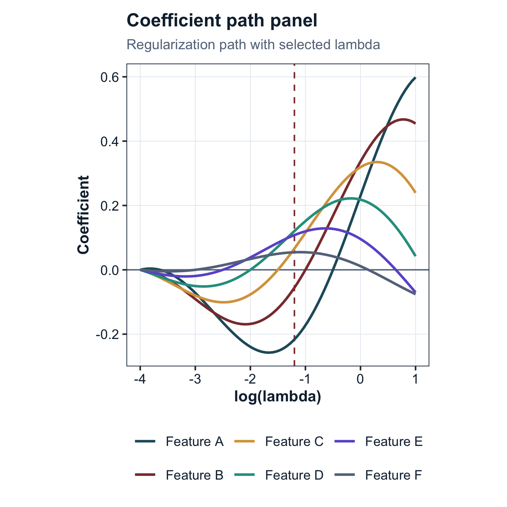

### Representative source files

- `/Volumes/七号/课题补充分析和写作/03出图/Figure 1/s.f1-分层分析.Rmd` (primary, score=633)
- `/Users/qihaoning/00工作/202603CTcluster/code_ref/current_article_templates/Main_Fig1_KM_Multicox_Binary/s.f1-分层分析.Rmd` (primary, score=633)
- `/Users/qihaoning/00工作/202603CTcluster/code_ref/current_article_templates/Main_Fig1_KM_Multicox_Ternary/s.f1-分层分析.Rmd` (primary, score=633)
- `/Users/qihaoning/00工作/202603CTcluster/official_mainline_clean_v1/code/omics_pipeline/joint_binary_manuscript_figures_v2/render_figure4_biology_v2.R` (primary, score=592)
- `/Volumes/七号/课题补充分析和写作/03出图/Figure 7/f7-免疫治疗队列分析.Rmd` (primary, score=435)

### Reference code

```r
suppressPackageStartupMessages({library(ggplot2); library(jsonlite)})
args_all <- commandArgs(FALSE)
file_arg <- args_all[grepl("^--file=", args_all)]
this_file <- if (length(file_arg)) sub("^--file=", "", file_arg[[1]]) else normalizePath(".")
template_dir <- dirname(normalizePath(this_file))
shared_theme <- file.path(dirname(template_dir), "_shared", "mas_theme.R")
source(shared_theme)
`%||%` <- function(x, y) if (is.null(x)) y else x
make_example_data <- function() {
  lambda <- seq(-4, 1, length.out=80); vars <- paste0("Feature ", LETTERS[1:6])
  do.call(rbind, lapply(seq_along(vars), function(i) data.frame(log_lambda=lambda, coefficient=(sin(lambda+i/2) * (7-i)/10) * pmax(0, (lambda+4)/5), feature=vars[i])))
}
make_plot <- function(data = make_example_data()) {
  ggplot(data, aes(log_lambda, coefficient, colour=feature)) + geom_hline(yintercept=0, linewidth=.45, colour=mas_palette$muted) + geom_vline(xintercept=-1.2, linetype="dashed", linewidth=.5, colour=mas_palette$secondary) + geom_line(linewidth=.82) + scale_colour_manual(values=rep(mas_discrete, length.out=6)) + labs(title="Coefficient path panel", subtitle="Regularization path with selected lambda", x="log(lambda)", y="Coefficient") + mas_theme() + theme(aspect.ratio=1)
}
if (sys.nframe() == 0) save_mas_plot(make_plot(), commandArgs(TRUE)[1] %||% "figures", "coefficient_path_panel", width = 4.8, height = 4.8)

```

## Generalizability subgroup composite

- Template ID: `generalizability_subgroup_composite_panel`
- Category: `forest_cox` / Forest / Cox model
- med-autoscience mapping: `generalizability_subgroup_composite_panel`
- Data contract: `cohort`, `subgroup`, `metric`, `lower`, `upper`
- Axis aspect policy: `square_axis_panel`

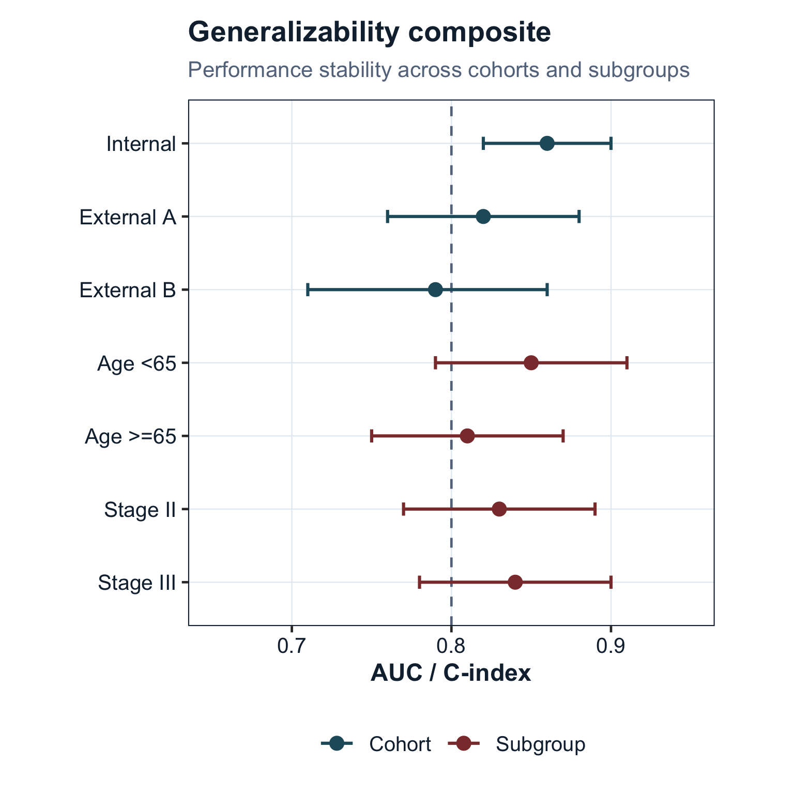

### Representative source files

- `/Volumes/七号/课题补充分析和写作/03出图/Figure 1/s.f1-分层分析.Rmd` (primary, score=633)
- `/Users/qihaoning/00工作/202603CTcluster/code_ref/current_article_templates/Main_Fig1_KM_Multicox_Binary/s.f1-分层分析.Rmd` (primary, score=633)
- `/Users/qihaoning/00工作/202603CTcluster/code_ref/current_article_templates/Main_Fig1_KM_Multicox_Ternary/s.f1-分层分析.Rmd` (primary, score=633)
- `/Users/qihaoning/00工作/202603CTcluster/official_mainline_clean_v1/code/omics_pipeline/joint_binary_manuscript_figures_v2/render_figure4_biology_v2.R` (primary, score=592)
- `/Volumes/七号/课题补充分析和写作/03出图/Figure 7/f7-免疫治疗队列分析.Rmd` (primary, score=435)

### Reference code

```r
suppressPackageStartupMessages({library(ggplot2); library(jsonlite)})
args_all <- commandArgs(FALSE)
file_arg <- args_all[grepl("^--file=", args_all)]
this_file <- if (length(file_arg)) sub("^--file=", "", file_arg[[1]]) else normalizePath(".")
template_dir <- dirname(normalizePath(this_file))
shared_theme <- file.path(dirname(template_dir), "_shared", "mas_theme.R")
source(shared_theme)
`%||%` <- function(x, y) if (is.null(x)) y else x
make_example_data <- function() {
  data.frame(cohort = factor(c("Internal", "External A", "External B", "Age <65", "Age >=65", "Stage II", "Stage III"), levels=rev(c("Internal", "External A", "External B", "Age <65", "Age >=65", "Stage II", "Stage III"))), metric = c(.86,.82,.79,.85,.81,.83,.84), lower=c(.82,.76,.71,.79,.75,.77,.78), upper=c(.90,.88,.86,.91,.87,.89,.90), family=c("Cohort","Cohort","Cohort","Subgroup","Subgroup","Subgroup","Subgroup"))
}
make_plot <- function(data = make_example_data()) {
  ggplot(data, aes(metric, cohort, colour=family)) + geom_vline(xintercept=.80, linetype="dashed", linewidth=.5, colour=mas_palette$muted) + geom_errorbar(aes(xmin=lower, xmax=upper), orientation="y", width=.18, linewidth=.65) + geom_point(size=2.4) + scale_colour_manual(values=mas_discrete[1:2]) + scale_x_continuous(limits=c(.65,.95)) + labs(title="Generalizability composite", subtitle="Performance stability across cohorts and subgroups", x="AUC / C-index", y=NULL) + mas_theme() + theme(aspect.ratio=1)
}
if (sys.nframe() == 0) save_mas_plot(make_plot(), commandArgs(TRUE)[1] %||% "figures", "generalizability_subgroup_composite_panel", width = 4.8, height = 4.8)

```

## Distribution comparison violin-box

- Template ID: `violin_box`
- Category: `violin_box` / Violin / box comparison
- med-autoscience mapping: `practical_factor_dot_figure`
- Data contract: `group`, `value`, `cohort`
- Axis aspect policy: `square_axis_panel`

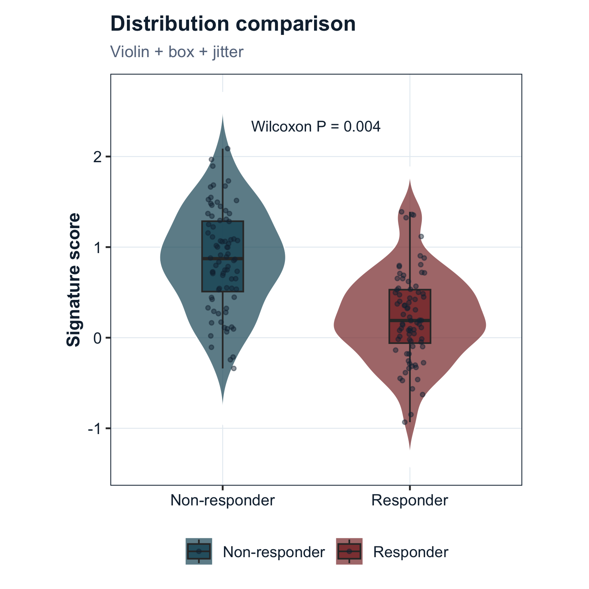

### Representative source files

- `/Users/qihaoning/00工作/202603CTcluster/official_mainline_clean_v1/code/omics_pipeline/joint_binary_manuscript_figures_v2/render_figure4_biology_v2.R` (primary, score=592)
- `/Volumes/七号/课题补充分析和写作/03出图/Figure 7/f7-免疫治疗队列分析.Rmd` (primary, score=435)
- `/Users/qihaoning/00工作/202603CTcluster/code_ref/current_article_templates/Main_Fig5_TIDE_IPS/f7-免疫治疗队列分析.Rmd` (primary, score=435)
- `/Users/qihaoning/00工作/202603CTcluster/official_mainline_clean_v1/code/omics_pipeline/joint_binary_manuscript_figures_v2/render_figure3_v2.R` (primary, score=303)
- `/Volumes/七号/课题补充分析和写作/03出图/Figure 3/f3e-geo队列hallmark.Rmd` (primary, score=183)

### Reference code

```r
suppressPackageStartupMessages({library(ggplot2); library(jsonlite)})
args_all <- commandArgs(FALSE)
file_arg <- args_all[grepl("^--file=", args_all)]
this_file <- if (length(file_arg)) sub("^--file=", "", file_arg[[1]]) else normalizePath(".")
template_dir <- dirname(normalizePath(this_file))
shared_theme <- file.path(dirname(template_dir), "_shared", "mas_theme.R")
source(shared_theme)
`%||%` <- function(x, y) if (is.null(x)) y else x
make_example_data <- function() { set.seed(12); data.frame(group = rep(c("Responder", "Non-responder"), each = 80), value = c(rnorm(80, 0.25, .55), rnorm(80, .85, .58))) }
make_plot <- function(data = make_example_data()) { ggplot(data, aes(group, value, fill = group)) + geom_violin(width = .82, alpha = .72, colour = "white", linewidth = .35, trim = FALSE) + geom_boxplot(width = .22, outlier.shape = NA, alpha = .9, linewidth = .45) + geom_jitter(width = .08, size = .9, alpha = .45, colour = mas_palette$neutral) + scale_fill_manual(values = mas_discrete[1:2]) + labs(title = "Distribution comparison", subtitle = "Violin + box + jitter", x = NULL, y = "Signature score") + annotate("text", x = 1.5, y = max(data$value) + .25, label = "Wilcoxon P = 0.004", size = 3.1, colour = mas_palette$neutral) + mas_theme() + theme(aspect.ratio=1) }
if (sys.nframe() == 0) save_mas_plot(make_plot(), commandArgs(TRUE)[1] %||% "figures", "violin_box", width = 4.8, height = 4.8)

```

## Stacked proportion bars

- Template ID: `bar_stacked`
- Category: `bar_stacked` / Bar / stacked proportion
- med-autoscience mapping: `risk_layering_monotonic_bars`
- Data contract: `cohort`, `class`, `n`, `fraction`
- Axis aspect policy: `free_long_or_composite`

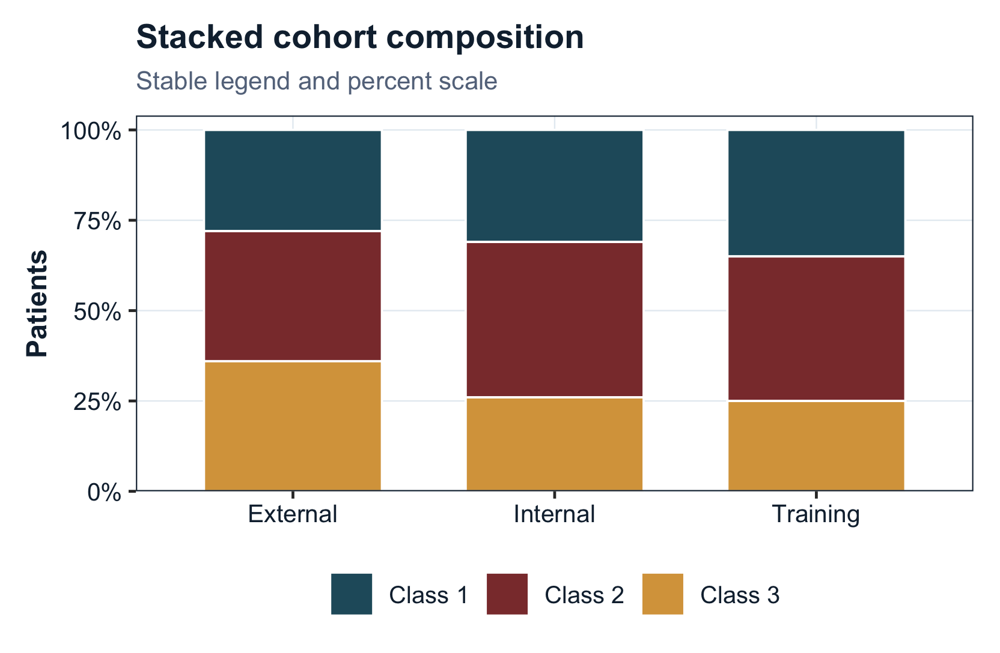

### Representative source files

- `/Volumes/七号/课题补充分析和写作/03出图/Figure 1/s.f1-分层分析.Rmd` (primary, score=633)
- `/Users/qihaoning/00工作/202603CTcluster/code_ref/current_article_templates/Main_Fig1_KM_Multicox_Binary/s.f1-分层分析.Rmd` (primary, score=633)
- `/Users/qihaoning/00工作/202603CTcluster/code_ref/current_article_templates/Main_Fig1_KM_Multicox_Ternary/s.f1-分层分析.Rmd` (primary, score=633)
- `/Volumes/七号/课题补充分析和写作/03出图/Figure 7/f7-免疫治疗队列分析.Rmd` (primary, score=435)
- `/Users/qihaoning/00工作/202603CTcluster/code_ref/current_article_templates/Main_Fig5_TIDE_IPS/f7-免疫治疗队列分析.Rmd` (primary, score=435)

### Reference code

```r
suppressPackageStartupMessages({library(ggplot2); library(jsonlite)})
args_all <- commandArgs(FALSE)
file_arg <- args_all[grepl("^--file=", args_all)]
this_file <- if (length(file_arg)) sub("^--file=", "", file_arg[[1]]) else normalizePath(".")
template_dir <- dirname(normalizePath(this_file))
shared_theme <- file.path(dirname(template_dir), "_shared", "mas_theme.R")
source(shared_theme)
`%||%` <- function(x, y) if (is.null(x)) y else x
make_example_data <- function() { data.frame(cohort = rep(c("Training", "Internal", "External"), each = 3), class = rep(c("Class 1", "Class 2", "Class 3"), times = 3), fraction = c(.35,.40,.25,.31,.43,.26,.28,.36,.36)) }
make_plot <- function(data = make_example_data()) { ggplot(data, aes(cohort, fraction, fill = class)) + geom_col(width = .68, colour = "white", linewidth = .4) + scale_fill_manual(values = mas_discrete[1:3]) + scale_y_continuous(labels = function(x) paste0(round(x * 100), "%"), expand = expansion(mult = c(0, .04))) + labs(title = "Stacked cohort composition", subtitle = "Stable legend and percent scale", x = NULL, y = "Patients") + mas_theme() }
if (sys.nframe() == 0) save_mas_plot(make_plot(), commandArgs(TRUE)[1] %||% "figures", "bar_stacked", width = 5.2, height = 3.4)

```

## Monotonic risk layering bars

- Template ID: `risk_layering_monotonic_bars`
- Category: `bar_stacked` / Bar / stacked proportion
- med-autoscience mapping: `risk_layering_monotonic_bars`
- Data contract: `risk_layer`, `event_rate`, `lower`, `upper`
- Axis aspect policy: `free_long_or_composite`

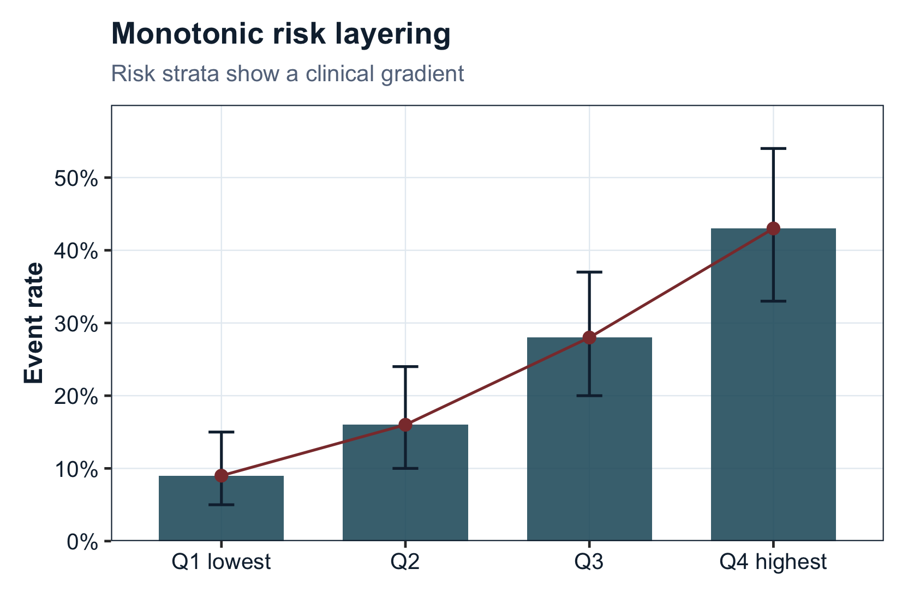

### Representative source files

- `/Volumes/七号/课题补充分析和写作/03出图/Figure 1/s.f1-分层分析.Rmd` (primary, score=633)
- `/Users/qihaoning/00工作/202603CTcluster/code_ref/current_article_templates/Main_Fig1_KM_Multicox_Binary/s.f1-分层分析.Rmd` (primary, score=633)
- `/Users/qihaoning/00工作/202603CTcluster/code_ref/current_article_templates/Main_Fig1_KM_Multicox_Ternary/s.f1-分层分析.Rmd` (primary, score=633)
- `/Volumes/七号/课题补充分析和写作/03出图/Figure 7/f7-免疫治疗队列分析.Rmd` (primary, score=435)
- `/Users/qihaoning/00工作/202603CTcluster/code_ref/current_article_templates/Main_Fig5_TIDE_IPS/f7-免疫治疗队列分析.Rmd` (primary, score=435)

### Reference code

```r
suppressPackageStartupMessages({library(ggplot2); library(jsonlite)})
args_all <- commandArgs(FALSE)
file_arg <- args_all[grepl("^--file=", args_all)]
this_file <- if (length(file_arg)) sub("^--file=", "", file_arg[[1]]) else normalizePath(".")
template_dir <- dirname(normalizePath(this_file))
shared_theme <- file.path(dirname(template_dir), "_shared", "mas_theme.R")
source(shared_theme)
`%||%` <- function(x, y) if (is.null(x)) y else x
make_example_data <- function() {
  data.frame(layer = factor(c("Q1 lowest", "Q2", "Q3", "Q4 highest"), levels = c("Q1 lowest", "Q2", "Q3", "Q4 highest")), event_rate = c(.09,.16,.28,.43), lower = c(.05,.10,.20,.33), upper = c(.15,.24,.37,.54))
}
make_plot <- function(data = make_example_data()) {
  ggplot(data, aes(layer, event_rate)) +
    geom_col(fill = mas_palette$primary, width = .68, alpha = .88) +
    geom_errorbar(aes(ymin = lower, ymax = upper), width = .14, linewidth = .55, colour = mas_palette$neutral) +
    geom_line(aes(group = 1), linewidth = .55, colour = mas_palette$secondary) + geom_point(size = 2, colour = mas_palette$secondary) +
    scale_y_continuous(labels = function(x) paste0(round(x*100), "%"), limits = c(0,.60), expand = c(0,0)) +
    labs(title = "Monotonic risk layering", subtitle = "Risk strata show a clinical gradient", x = NULL, y = "Event rate") + mas_theme()
}
if (sys.nframe() == 0) save_mas_plot(make_plot(), commandArgs(TRUE)[1] %||% "figures", "risk_layering_monotonic_bars", width = 5.2, height = 3.4)

```

## Scatter correlation panel

- Template ID: `scatter_correlation`
- Category: `scatter_correlation` / Scatter / correlation
- med-autoscience mapping: `feature_response_support_domain_panel`
- Data contract: `x`, `y`, `group`
- Axis aspect policy: `square_axis_panel`

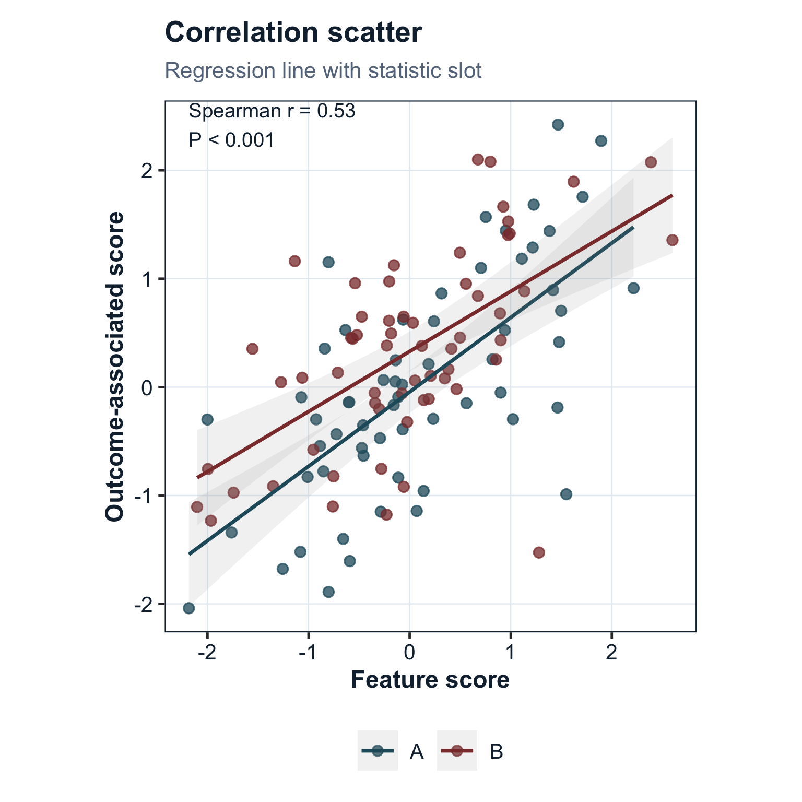

### Representative source files

- `/Users/qihaoning/00工作/202603CTcluster/official_mainline_clean_v1/code/omics_pipeline/joint_binary_manuscript_figures_v2/render_figure4_biology_v2.R` (primary, score=592)
- `/Volumes/七号/课题补充分析和写作/03出图/Figure 7/f7-免疫治疗队列分析.Rmd` (primary, score=435)
- `/Users/qihaoning/00工作/202603CTcluster/code_ref/current_article_templates/Main_Fig5_TIDE_IPS/f7-免疫治疗队列分析.Rmd` (primary, score=435)
- `/Users/qihaoning/00工作/202603CTcluster/official_mainline_clean_v1/code/omics_pipeline/joint_binary_manuscript_figures_v2/render_figure3_v2.R` (primary, score=303)
- `/Volumes/七号/课题补充分析和写作/03出图/Figure 1/f2fgh-多因素分析.Rmd` (primary, score=175)

### Reference code

```r
suppressPackageStartupMessages({library(ggplot2); library(jsonlite)})
args_all <- commandArgs(FALSE)
file_arg <- args_all[grepl("^--file=", args_all)]
this_file <- if (length(file_arg)) sub("^--file=", "", file_arg[[1]]) else normalizePath(".")
template_dir <- dirname(normalizePath(this_file))
shared_theme <- file.path(dirname(template_dir), "_shared", "mas_theme.R")
source(shared_theme)
`%||%` <- function(x, y) if (is.null(x)) y else x
make_example_data <- function() { set.seed(5); x <- rnorm(120); group <- rep(c("A", "B"), each = 60); data.frame(x=x, y=.58*x + rnorm(120, sd=.72) + ifelse(group=="B", .25, 0), group=group) }
make_plot <- function(data = make_example_data()) { ggplot(data, aes(x, y, colour = group)) + geom_point(size = 1.8, alpha = .76) + geom_smooth(method = "lm", formula = y ~ x, se = TRUE, linewidth = .75, alpha = .12) + scale_colour_manual(values = mas_discrete[1:2]) + labs(title = "Correlation scatter", subtitle = "Regression line with statistic slot", x = "Feature score", y = "Outcome-associated score") + annotate("text", x = min(data$x), y = max(data$y), hjust = 0, label = "Spearman r = 0.53
P < 0.001", size = 3.05, colour = mas_palette$neutral) + mas_theme() + theme(aspect.ratio=1) }
if (sys.nframe() == 0) save_mas_plot(make_plot(), commandArgs(TRUE)[1] %||% "figures", "scatter_correlation", width = 4.8, height = 4.8)

```

## Embedding scatter

- Template ID: `embedding_umap_tsne`
- Category: `embedding_umap_tsne` / UMAP / t-SNE embedding
- med-autoscience mapping: `umap_scatter_grouped / tsne_scatter_grouped / pca_scatter_grouped`
- Data contract: `dim1`, `dim2`, `cell_type`, `cohort`
- Axis aspect policy: `square_axis_panel`

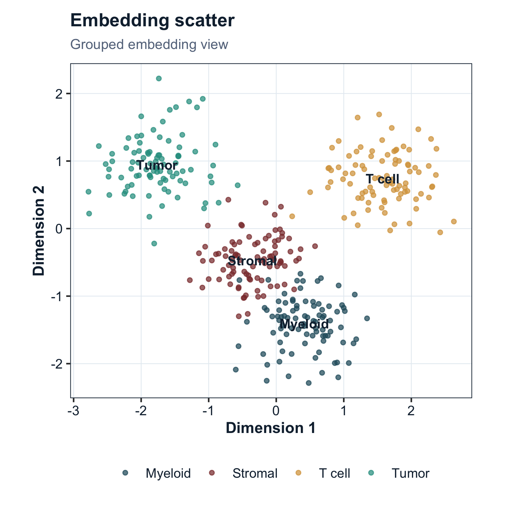

### Representative source files

- `/Volumes/七号/课题补充分析和写作/02 单细胞相关/gse178341/gse178341.Rmd` (reference, score=331)
- `/Volumes/七号/课题补充分析和写作/02 单细胞相关/旧文件/data_analysis.R` (reference, score=128)
- `/Volumes/七号/课题补充分析和写作/02 单细胞相关/旧文件/gsea_irGSEA.R` (reference, score=117)
- `/Users/qihaoning/00工作/202603CTcluster/joint_binary_bundle_v1/snapshots/manuscript_figures_joint_binary_nature_v2/src_py/render_figure1_v2.R` (reference, score=103)
- `/Volumes/七号/课题补充分析和写作/02 单细胞相关/GSE132465/gse132465.Rmd` (reference, score=103)

### Reference code

```r
suppressPackageStartupMessages({library(ggplot2); library(jsonlite)})
args_all <- commandArgs(FALSE)
file_arg <- args_all[grepl("^--file=", args_all)]
this_file <- if (length(file_arg)) sub("^--file=", "", file_arg[[1]]) else normalizePath(".")
template_dir <- dirname(normalizePath(this_file))
shared_theme <- file.path(dirname(template_dir), "_shared", "mas_theme.R")
source(shared_theme)
`%||%` <- function(x, y) if (is.null(x)) y else x
make_example_data <- function() { set.seed(33); centers <- data.frame(cell_type = c("Tumor", "T cell", "Myeloid", "Stromal"), cx = c(-1.8, 1.6, .4, -0.4), cy = c(.9, .8, -1.4, -0.5)); do.call(rbind, lapply(seq_len(nrow(centers)), function(i) data.frame(dim1 = rnorm(90, centers$cx[i], .45), dim2 = rnorm(90, centers$cy[i], .38), cell_type = centers$cell_type[i]))) }
make_plot <- function(data = make_example_data()) { centers <- aggregate(cbind(dim1, dim2) ~ cell_type, data, mean); ggplot(data, aes(dim1, dim2, colour = cell_type)) + geom_point(size = 1.2, alpha = .72) + geom_text(data = centers, aes(label = cell_type), colour = mas_palette$neutral, fontface = "bold", size = 3.2, show.legend = FALSE) + scale_colour_manual(values = mas_discrete[1:4]) + coord_equal() + labs(title = "Embedding scatter", subtitle = "Grouped embedding view", x = "Dimension 1", y = "Dimension 2") + mas_theme() + theme(panel.grid = element_blank()) }
if (sys.nframe() == 0) save_mas_plot(make_plot(), commandArgs(TRUE)[1] %||% "figures", "embedding_umap_tsne", width = 4.8, height = 4.8)

```

## ComplexHeatmap annotated matrix

- Template ID: `heatmap`
- Category: `heatmap` / Heatmap / matrix pattern
- med-autoscience mapping: `heatmap_group_comparison / clustered_heatmap`
- Data contract: `matrix`, `row_annotation`, `column_annotation`, `value`
- Axis aspect policy: `free_long_or_composite`

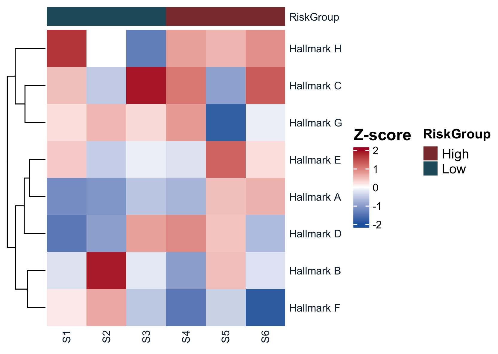

### Representative source files

- `/Users/qihaoning/00工作/202603CTcluster/official_mainline_clean_v1/code/omics_pipeline/joint_binary_manuscript_figures_v2/render_figure4_biology_v2.R` (primary, score=592)
- `/Users/qihaoning/00工作/202603CTcluster/official_mainline_clean_v1/code/omics_pipeline/joint_binary_manuscript_figures_v2/render_figure3_v2.R` (primary, score=303)
- `/Users/qihaoning/00工作/202603CTcluster/official_mainline_clean_v1/code/omics_pipeline/joint_binary_manuscript_figures_v2/render_figure3_features_v2.R` (primary, score=154)
- `/Users/qihaoning/00工作/202603CTcluster/official_mainline_clean_v1/code/omics_pipeline/joint_binary_manuscript_figures_v2/render_figure2_v2.R` (primary, score=128)
- `/Volumes/七号/课题补充分析和写作/03出图/Figure 3/f3c-聚类热图.Rmd` (primary, score=121)

### Reference code

```r
suppressPackageStartupMessages({library(ggplot2); library(jsonlite)})
args_all <- commandArgs(FALSE)
file_arg <- args_all[grepl("^--file=", args_all)]
this_file <- if (length(file_arg)) sub("^--file=", "", file_arg[[1]]) else normalizePath(".")
template_dir <- dirname(normalizePath(this_file))
shared_theme <- file.path(dirname(template_dir), "_shared", "mas_theme.R")
source(shared_theme)
`%||%` <- function(x, y) if (is.null(x)) y else x
make_example_data <- function() {
  set.seed(3)
  mat <- matrix(rnorm(8 * 6), nrow = 8)
  rownames(mat) <- paste0("Hallmark ", LETTERS[1:8])
  colnames(mat) <- paste0("S", 1:6)
  annotation <- data.frame(RiskGroup = rep(c("Low", "High"), each = 3), row.names = colnames(mat))
  list(mat = mat, annotation = annotation)
}
make_plot <- function(data = make_example_data()) {
  col_fun <- circlize::colorRamp2(c(-2, 0, 2), c(mas_palette$blue, "white", mas_palette$red))
  ha <- ComplexHeatmap::HeatmapAnnotation(
    df = data$annotation,
    col = list(RiskGroup = c(Low = mas_palette$primary, High = mas_palette$secondary)),
    show_annotation_name = TRUE,
    annotation_name_gp = grid::gpar(col = mas_palette$neutral, fontsize = 8)
  )
  ht <- ComplexHeatmap::Heatmap(
    scale(data$mat),
    name = "Z-score",
    col = col_fun,
    top_annotation = ha,
    cluster_rows = TRUE,
    cluster_columns = FALSE,
    show_column_names = TRUE,
    row_names_gp = grid::gpar(fontsize = 8, col = mas_palette$neutral),
    column_names_gp = grid::gpar(fontsize = 8, col = mas_palette$neutral),
    border = FALSE,
    rect_gp = grid::gpar(col = NA),
    heatmap_legend_param = list(title_gp = grid::gpar(fontface = "bold"), labels_gp = grid::gpar(fontsize = 8))
  )
  grid::grid.grabExpr(ComplexHeatmap::draw(ht, heatmap_legend_side = "right", annotation_legend_side = "right"))
}
if (sys.nframe() == 0) save_mas_plot(make_plot(), commandArgs(TRUE)[1] %||% "figures", "heatmap", width = 5.2, height = 3.7)

```

## Binary confusion matrix heatmap

- Template ID: `confusion_matrix_heatmap_binary`
- Category: `heatmap` / Heatmap / matrix pattern
- med-autoscience mapping: `confusion_matrix_heatmap_binary`
- Data contract: `truth`, `predicted`, `n`
- Axis aspect policy: `square_axis_panel`

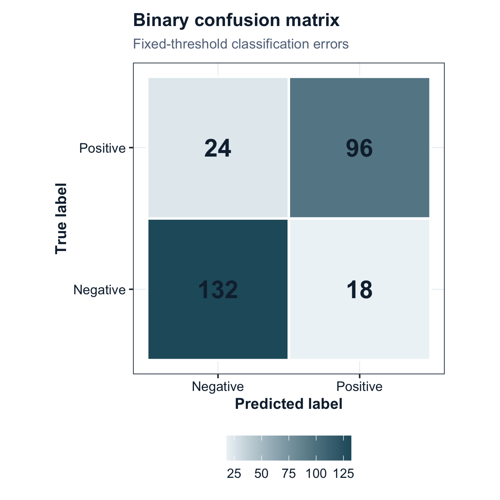

### Representative source files

- `/Users/qihaoning/00工作/202603CTcluster/official_mainline_clean_v1/code/omics_pipeline/joint_binary_manuscript_figures_v2/render_figure4_biology_v2.R` (primary, score=592)
- `/Users/qihaoning/00工作/202603CTcluster/official_mainline_clean_v1/code/omics_pipeline/joint_binary_manuscript_figures_v2/render_figure3_v2.R` (primary, score=303)
- `/Users/qihaoning/00工作/202603CTcluster/official_mainline_clean_v1/code/omics_pipeline/joint_binary_manuscript_figures_v2/render_figure3_features_v2.R` (primary, score=154)
- `/Users/qihaoning/00工作/202603CTcluster/official_mainline_clean_v1/code/omics_pipeline/joint_binary_manuscript_figures_v2/render_figure2_v2.R` (primary, score=128)
- `/Volumes/七号/课题补充分析和写作/03出图/Figure 3/f3c-聚类热图.Rmd` (primary, score=121)

### Reference code

```r
suppressPackageStartupMessages({library(ggplot2); library(jsonlite)})
args_all <- commandArgs(FALSE)
file_arg <- args_all[grepl("^--file=", args_all)]
this_file <- if (length(file_arg)) sub("^--file=", "", file_arg[[1]]) else normalizePath(".")
template_dir <- dirname(normalizePath(this_file))
shared_theme <- file.path(dirname(template_dir), "_shared", "mas_theme.R")
source(shared_theme)
`%||%` <- function(x, y) if (is.null(x)) y else x
make_example_data <- function() { data.frame(predicted=rep(c("Negative","Positive"), 2), truth=rep(c("Negative","Positive"), each=2), n=c(132,18,24,96)) }
make_plot <- function(data = make_example_data()) { ggplot(data, aes(predicted, truth, fill=n)) + geom_tile(colour="white", linewidth=.8) + geom_text(aes(label=n), size=6, fontface="bold", colour=mas_palette$neutral) + scale_fill_gradient(low=mas_palette$light, high=mas_palette$primary) + coord_equal() + labs(title="Binary confusion matrix", subtitle="Fixed-threshold classification errors", x="Predicted label", y="True label", fill="N") + mas_theme() }
if (sys.nframe() == 0) save_mas_plot(make_plot(), commandArgs(TRUE)[1] %||% "figures", "confusion_matrix_heatmap_binary", width = 4.8, height = 4.8)

```

## Differential-expression volcano

- Template ID: `volcano_deg`
- Category: `volcano_deg` / Volcano / differential expression
- med-autoscience mapping: `omics_volcano_panel`
- Data contract: `feature`, `log2_fc`, `neg_log10_p`, `status`
- Axis aspect policy: `square_axis_panel`

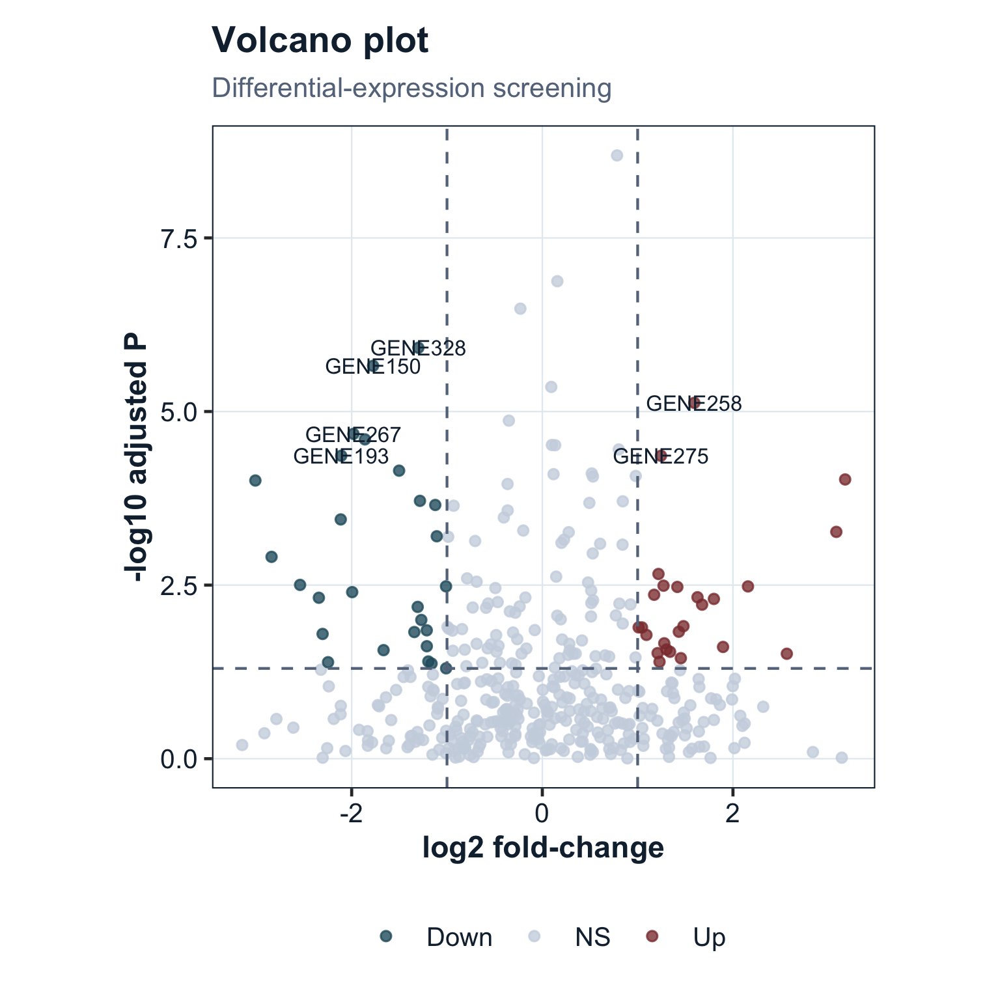

### Representative source files

- `/Users/qihaoning/00工作/202603CTcluster/official_mainline_clean_v1/code/omics_pipeline/joint_binary_manuscript_figures_v2/render_figure4_biology_v2.R` (primary, score=592)
- `/Users/qihaoning/00工作/202603CTcluster/official_mainline_clean_v1/code/omics_pipeline/joint_binary_manuscript_figures_v2/render_figure3_v2.R` (primary, score=303)
- `/Volumes/七号/课题补充分析和写作/03出图/Figure 6/f6a-gsea.Rmd` (primary, score=254)
- `/Users/qihaoning/00工作/202603CTcluster/official_mainline_clean_v1/code/omics_pipeline/joint_binary_manuscript_figures_v2/stage_figure4_biology_v2.py` (primary, score=177)
- `/Users/qihaoning/00工作/202603CTcluster/official_mainline_clean_v1/code/omics_pipeline/joint_binary_manuscript_figures_v2/render_figure1_v2.R` (primary, score=114)

### Reference code

```r
suppressPackageStartupMessages({library(ggplot2); library(jsonlite)})
args_all <- commandArgs(FALSE)
file_arg <- args_all[grepl("^--file=", args_all)]
this_file <- if (length(file_arg)) sub("^--file=", "", file_arg[[1]]) else normalizePath(".")
template_dir <- dirname(normalizePath(this_file))
shared_theme <- file.path(dirname(template_dir), "_shared", "mas_theme.R")
source(shared_theme)
`%||%` <- function(x, y) if (is.null(x)) y else x
make_example_data <- function() { set.seed(9); n <- 420; d <- data.frame(feature = paste0("GENE", seq_len(n)), log2_fc = rnorm(n, 0, 1.15), neg_log10_p = rexp(n, rate = .8)); d$status <- ifelse(d$log2_fc > 1 & d$neg_log10_p > 1.3, "Up", ifelse(d$log2_fc < -1 & d$neg_log10_p > 1.3, "Down", "NS")); d }
make_plot <- function(data = make_example_data()) { labels <- head(subset(data, status != "NS")[order(-subset(data, status != "NS")$neg_log10_p), ], 8); ggplot(data, aes(log2_fc, neg_log10_p, colour = status)) + geom_point(size = 1.35, alpha = .78) + geom_vline(xintercept = c(-1, 1), linetype = "dashed", linewidth = .45, colour = mas_palette$muted) + geom_hline(yintercept = 1.3, linetype = "dashed", linewidth = .45, colour = mas_palette$muted) + geom_text(data = labels, aes(label = feature), size = 2.6, check_overlap = TRUE, colour = mas_palette$neutral, show.legend=FALSE) + scale_colour_manual(values = c(Down = mas_palette$primary, NS = "#CBD5E1", Up = mas_palette$secondary)) + labs(title = "Volcano plot", subtitle = "Differential-expression screening", x = "log2 fold-change", y = "-log10 adjusted P") + mas_theme() + theme(aspect.ratio=1) }
if (sys.nframe() == 0) save_mas_plot(make_plot(), commandArgs(TRUE)[1] %||% "figures", "volcano_deg", width = 4.8, height = 4.8)

```

## Pathway enrichment dotplot

- Template ID: `gsea_enrichment`
- Category: `gsea_enrichment` / GSEA / enrichment
- med-autoscience mapping: `pathway_enrichment_dotplot_panel / gsva_ssgsea_heatmap`
- Data contract: `pathway`, `gene_ratio`, `nes`, `fdr`
- Axis aspect policy: `free_long_or_composite`

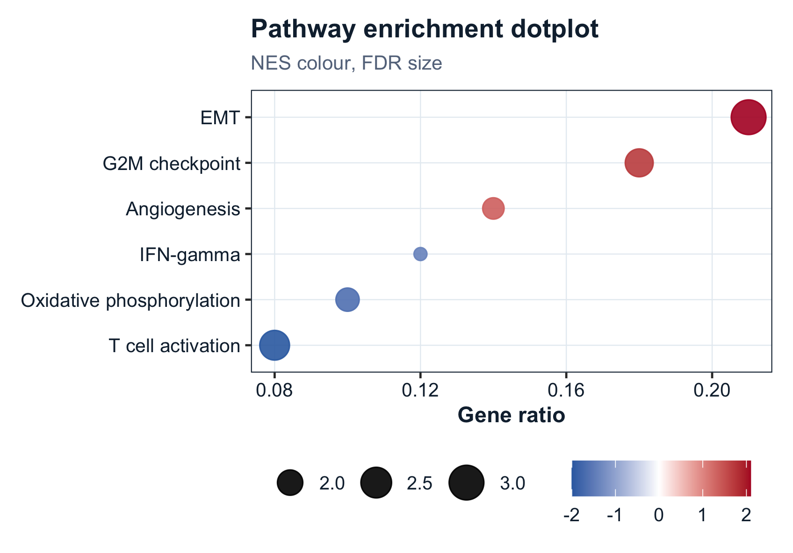

### Representative source files

- `/Users/qihaoning/00工作/202603CTcluster/official_mainline_clean_v1/code/omics_pipeline/joint_binary_manuscript_figures_v2/render_figure4_biology_v2.R` (primary, score=592)
- `/Users/qihaoning/00工作/202603CTcluster/official_mainline_clean_v1/code/omics_pipeline/joint_binary_manuscript_figures_v2/render_figure3_v2.R` (primary, score=303)
- `/Volumes/七号/课题补充分析和写作/03出图/Figure 6/f6a-gsea.Rmd` (primary, score=254)
- `/Volumes/七号/课题补充分析和写作/03出图/Figure 3/f3e-geo队列hallmark.Rmd` (primary, score=183)
- `/Users/qihaoning/00工作/202603CTcluster/official_mainline_clean_v1/code/omics_pipeline/joint_binary_manuscript_figures_v2/stage_figure4_biology_v2.py` (primary, score=177)

### Reference code

```r
suppressPackageStartupMessages({library(ggplot2); library(jsonlite)})
args_all <- commandArgs(FALSE)
file_arg <- args_all[grepl("^--file=", args_all)]
this_file <- if (length(file_arg)) sub("^--file=", "", file_arg[[1]]) else normalizePath(".")
template_dir <- dirname(normalizePath(this_file))
shared_theme <- file.path(dirname(template_dir), "_shared", "mas_theme.R")
source(shared_theme)
`%||%` <- function(x, y) if (is.null(x)) y else x
make_example_data <- function() { data.frame(pathway = factor(c("EMT", "G2M checkpoint", "Angiogenesis", "IFN-gamma", "Oxidative phosphorylation", "T cell activation"), levels = rev(c("EMT", "G2M checkpoint", "Angiogenesis", "IFN-gamma", "Oxidative phosphorylation", "T cell activation"))), gene_ratio = c(.21,.18,.14,.12,.10,.08), nes = c(2.1,1.7,1.35,-1.4,-1.65,-2.0), fdr = c(.001,.006,.018,.030,.014,.004)) }
make_plot <- function(data = make_example_data()) { ggplot(data, aes(gene_ratio, pathway, size = -log10(fdr), colour = nes)) + geom_point(alpha = .9) + scale_colour_gradient2(low = mas_palette$blue, mid = "white", high = mas_palette$red, midpoint = 0) + scale_size(range = c(2.6, 7.5)) + labs(title = "Pathway enrichment dotplot", subtitle = "NES colour, FDR size", x = "Gene ratio", y = NULL, colour = "NES", size = "-log10 FDR") + mas_theme() }
if (sys.nframe() == 0) save_mas_plot(make_plot(), commandArgs(TRUE)[1] %||% "figures", "gsea_enrichment", width = 5.3, height = 3.7)

```

## Mutation landscape oncoplot

- Template ID: `oncoplot_mutation`
- Category: `oncoplot_mutation` / Oncoplot / mutation landscape
- med-autoscience mapping: `oncoplot_mutation_landscape_panel / genomic_alteration_landscape_panel`
- Data contract: `maf`, `clinical_annotation`, `gene`, `sample`
- Axis aspect policy: `free_long_or_composite`

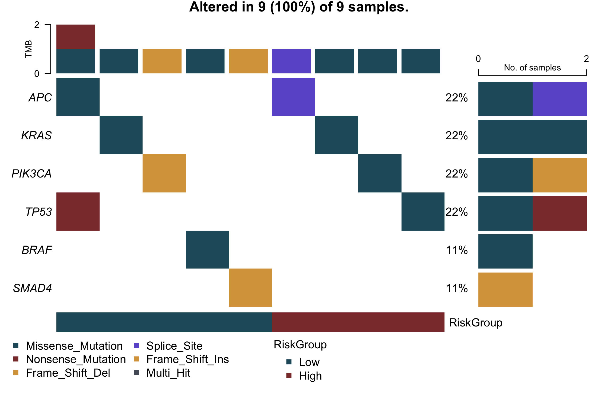

### Representative source files

- `/Volumes/七号/课题补充分析和写作/03出图/Figure 1/s.f1-分层分析.Rmd` (primary, score=633)
- `/Users/qihaoning/00工作/202603CTcluster/code_ref/current_article_templates/Main_Fig1_KM_Multicox_Binary/s.f1-分层分析.Rmd` (primary, score=633)
- `/Users/qihaoning/00工作/202603CTcluster/code_ref/current_article_templates/Main_Fig1_KM_Multicox_Ternary/s.f1-分层分析.Rmd` (primary, score=633)
- `/Users/qihaoning/00工作/202603CTcluster/official_mainline_clean_v1/code/omics_pipeline/joint_binary_manuscript_figures_v2/render_figure4_biology_v2.R` (primary, score=592)
- `/Users/qihaoning/00工作/202603CTcluster/official_mainline_clean_v1/code/omics_pipeline/joint_binary_manuscript_figures_v2/render_figure3_v2.R` (primary, score=303)

### Reference code

```r
suppressPackageStartupMessages({library(ggplot2); library(jsonlite); library(grid); library(graphics)})
args_all <- commandArgs(FALSE)
file_arg <- args_all[grepl("^--file=", args_all)]
this_file <- if (length(file_arg)) sub("^--file=", "", file_arg[[1]]) else normalizePath(".")
template_dir <- dirname(normalizePath(this_file))
shared_theme <- file.path(dirname(template_dir), "_shared", "mas_theme.R")
source(shared_theme)
`%||%` <- function(x, y) if (is.null(x)) y else x
make_example_data <- function() {
  data.frame(
    Hugo_Symbol = c("APC", "TP53", "KRAS", "SMAD4", "PIK3CA", "BRAF", "APC", "KRAS", "TP53", "PIK3CA"),
    Chromosome = c("5", "17", "12", "18", "3", "7", "5", "12", "17", "3"),
    Start_Position = seq(1001, 1010),
    End_Position = seq(1001, 1010),
    Reference_Allele = "A",
    Tumor_Seq_Allele2 = "T",
    Variant_Classification = c("Missense_Mutation", "Nonsense_Mutation", "Missense_Mutation", "Frame_Shift_Del", "Missense_Mutation", "Missense_Mutation", "Splice_Site", "Missense_Mutation", "Missense_Mutation", "Frame_Shift_Ins"),
    Variant_Type = "SNP",
    Tumor_Sample_Barcode = c("S01", "S01", "S02", "S03", "S04", "S05", "S06", "S07", "S08", "S09")
  )
}
make_plot <- function(data = make_example_data()) {
  clinical_df <- data.frame(
    Tumor_Sample_Barcode = unique(data$Tumor_Sample_Barcode),
    RiskGroup = rep(c("Low", "High"), length.out = length(unique(data$Tumor_Sample_Barcode)))
  )
  maf_obj <- maftools::read.maf(maf = data, clinicalData = clinical_df, verbose = FALSE)
  op <- graphics::par(no.readonly = TRUE)
  on.exit(graphics::par(op), add = TRUE)
  graphics::par(mar = c(1.2, 1.2, 1.2, 1.2), xpd = NA)
  maftools::oncoplot(
    maf = maf_obj,
    top = 8,
    fontSize = 0.8,
    showTumorSampleBarcodes = FALSE,
    clinicalFeatures = "RiskGroup",
    sortByAnnotation = TRUE,
    annotationColor = list(RiskGroup = c(Low = mas_palette$primary, High = mas_palette$secondary)),
    colors = c(Missense_Mutation = mas_palette$primary, Nonsense_Mutation = mas_palette$secondary, Frame_Shift_Del = mas_palette$accent, Frame_Shift_Ins = mas_palette$accent, Splice_Site = mas_palette$purple),
    bgCol = "white",
    borderCol = NA
  )
}

if (sys.nframe() == 0) {
  output_dir <- commandArgs(TRUE)[1] %||% "figures"
  dir.create(output_dir, recursive = TRUE, showWarnings = FALSE)
  png(file.path(output_dir, "oncoplot_mutation.png"), width = 7.0, height = 4.8, units = "in", res = 320, bg = "white")
  make_plot()
  dev.off()
  pdf(file.path(output_dir, "oncoplot_mutation.pdf"), width = 7.0, height = 4.8, bg = "white", useDingbats = FALSE)
  make_plot()
  dev.off()
}


```

## Genomic alteration consequence

- Template ID: `genomic_alteration_consequence_panel`
- Category: `oncoplot_mutation` / Oncoplot / mutation landscape
- med-autoscience mapping: `genomic_alteration_consequence_panel`
- Data contract: `alteration`, `estimate`, `lower`, `upper`, `q_value`
- Axis aspect policy: `free_long_or_composite`

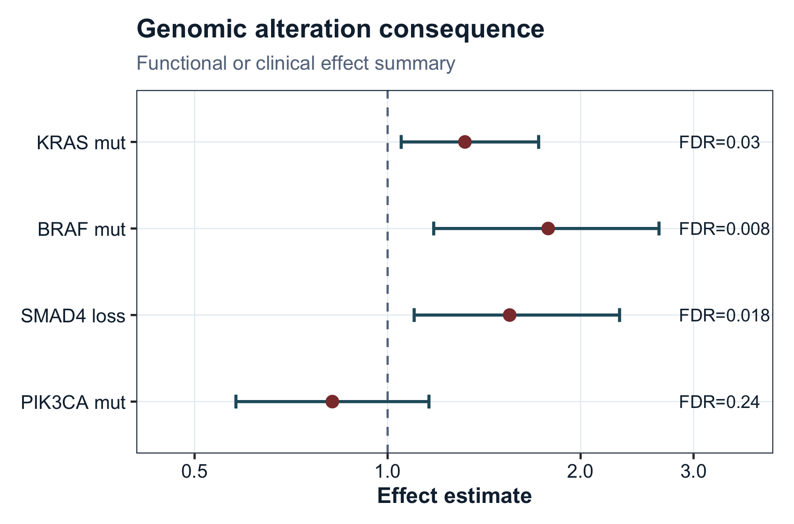

### Representative source files

- `/Volumes/七号/课题补充分析和写作/03出图/Figure 1/s.f1-分层分析.Rmd` (primary, score=633)
- `/Users/qihaoning/00工作/202603CTcluster/code_ref/current_article_templates/Main_Fig1_KM_Multicox_Binary/s.f1-分层分析.Rmd` (primary, score=633)
- `/Users/qihaoning/00工作/202603CTcluster/code_ref/current_article_templates/Main_Fig1_KM_Multicox_Ternary/s.f1-分层分析.Rmd` (primary, score=633)
- `/Users/qihaoning/00工作/202603CTcluster/official_mainline_clean_v1/code/omics_pipeline/joint_binary_manuscript_figures_v2/render_figure4_biology_v2.R` (primary, score=592)
- `/Users/qihaoning/00工作/202603CTcluster/official_mainline_clean_v1/code/omics_pipeline/joint_binary_manuscript_figures_v2/render_figure3_v2.R` (primary, score=303)

### Reference code

```r
suppressPackageStartupMessages({library(ggplot2); library(jsonlite)})
args_all <- commandArgs(FALSE)
file_arg <- args_all[grepl("^--file=", args_all)]
this_file <- if (length(file_arg)) sub("^--file=", "", file_arg[[1]]) else normalizePath(".")
template_dir <- dirname(normalizePath(this_file))
shared_theme <- file.path(dirname(template_dir), "_shared", "mas_theme.R")
source(shared_theme)
`%||%` <- function(x, y) if (is.null(x)) y else x
make_example_data <- function() { data.frame(alteration=factor(c("KRAS mut", "BRAF mut", "SMAD4 loss", "PIK3CA mut"), levels=rev(c("KRAS mut", "BRAF mut", "SMAD4 loss", "PIK3CA mut"))), estimate=c(1.32,1.78,1.55,.82), lower=c(1.05,1.18,1.10,.58), upper=c(1.72,2.65,2.30,1.16), q=c(.030,.008,.018,.24)) }
make_plot <- function(data = make_example_data()) { ggplot(data, aes(estimate, alteration)) + geom_vline(xintercept=1, linetype="dashed", colour=mas_palette$muted, linewidth=.5) + geom_errorbar(aes(xmin=lower, xmax=upper), orientation="y", width=.16, colour=mas_palette$primary, linewidth=.7) + geom_point(size=2.4, colour=mas_palette$secondary) + geom_text(aes(x=2.85, label=paste0("FDR=", q)), hjust=0, size=3, colour=mas_palette$neutral) + scale_x_log10(limits=c(.45,3.6), breaks=c(.5,1,2,3)) + labs(title="Genomic alteration consequence", subtitle="Functional or clinical effect summary", x="Effect estimate", y=NULL) + mas_theme() }
if (sys.nframe() == 0) save_mas_plot(make_plot(), commandArgs(TRUE)[1] %||% "figures", "genomic_alteration_consequence_panel", width = 5.3, height = 3.5)

```

## CNV recurrence summary

- Template ID: `cnv_recurrence_summary_panel`
- Category: `oncoplot_mutation` / Oncoplot / mutation landscape
- med-autoscience mapping: `cnv_recurrence_summary_panel`
- Data contract: `chromosome`, `event`, `frequency`
- Axis aspect policy: `free_long_or_composite`

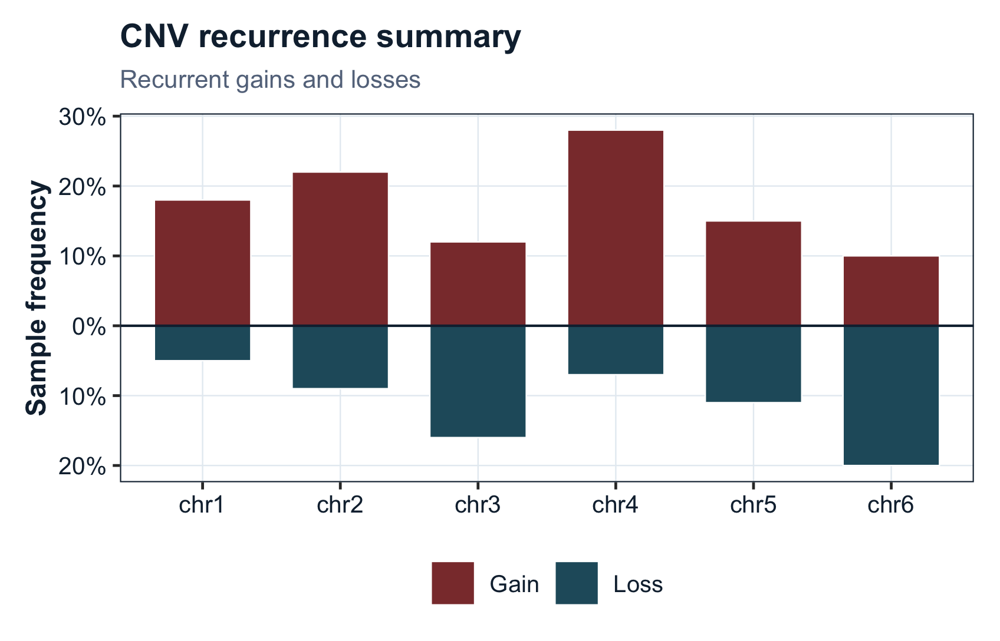

### Representative source files

- `/Volumes/七号/课题补充分析和写作/03出图/Figure 1/s.f1-分层分析.Rmd` (primary, score=633)
- `/Users/qihaoning/00工作/202603CTcluster/code_ref/current_article_templates/Main_Fig1_KM_Multicox_Binary/s.f1-分层分析.Rmd` (primary, score=633)
- `/Users/qihaoning/00工作/202603CTcluster/code_ref/current_article_templates/Main_Fig1_KM_Multicox_Ternary/s.f1-分层分析.Rmd` (primary, score=633)
- `/Users/qihaoning/00工作/202603CTcluster/official_mainline_clean_v1/code/omics_pipeline/joint_binary_manuscript_figures_v2/render_figure4_biology_v2.R` (primary, score=592)
- `/Users/qihaoning/00工作/202603CTcluster/official_mainline_clean_v1/code/omics_pipeline/joint_binary_manuscript_figures_v2/render_figure3_v2.R` (primary, score=303)

### Reference code

```r
suppressPackageStartupMessages({library(ggplot2); library(jsonlite)})
args_all <- commandArgs(FALSE)
file_arg <- args_all[grepl("^--file=", args_all)]
this_file <- if (length(file_arg)) sub("^--file=", "", file_arg[[1]]) else normalizePath(".")
template_dir <- dirname(normalizePath(this_file))
shared_theme <- file.path(dirname(template_dir), "_shared", "mas_theme.R")
source(shared_theme)
`%||%` <- function(x, y) if (is.null(x)) y else x
make_example_data <- function() { data.frame(chrom=factor(rep(paste0("chr",1:6), each=2), levels=paste0("chr",1:6)), event=rep(c("Gain","Loss"),6), freq=c(.18,.05,.22,.09,.12,.16,.28,.07,.15,.11,.10,.20)) }
make_plot <- function(data = make_example_data()) { ggplot(data, aes(chrom, ifelse(event=="Loss", -freq, freq), fill=event)) + geom_col(width=.7, colour="white", linewidth=.25) + geom_hline(yintercept=0, colour=mas_palette$neutral, linewidth=.45) + scale_fill_manual(values=c(Gain=mas_palette$secondary, Loss=mas_palette$primary)) + scale_y_continuous(labels=function(x) paste0(abs(round(x*100)), "%")) + labs(title="CNV recurrence summary", subtitle="Recurrent gains and losses", x=NULL, y="Sample frequency") + mas_theme() }
if (sys.nframe() == 0) save_mas_plot(make_plot(), commandArgs(TRUE)[1] %||% "figures", "cnv_recurrence_summary_panel", width = 5.3, height = 3.4)

```

## Ranked risk-score waterfall

- Template ID: `waterfall`
- Category: `waterfall` / Waterfall / ranked risk score
- med-autoscience mapping: `risk_layering_monotonic_bars`
- Data contract: `sample`, `score`, `response`
- Axis aspect policy: `free_long_or_composite`

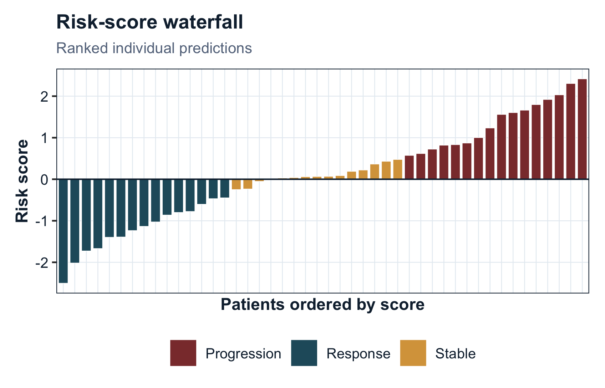

### Representative source files

- `/Volumes/七号/课题补充分析和写作/03出图/Figure 7/f7-免疫治疗队列分析.Rmd` (primary, score=435)
- `/Users/qihaoning/00工作/202603CTcluster/code_ref/current_article_templates/Main_Fig5_TIDE_IPS/f7-免疫治疗队列分析.Rmd` (primary, score=435)
- `/Volumes/七号/课题补充分析和写作/03出图/Figure 5/f5c-生存分析(贝伐使用os).Rmd` (primary, score=314)
- `/Users/qihaoning/00工作/202603CTcluster/ct_cluster_ref/downstream/code/7_mutation_analysis.R` (primary, score=170)
- `/Users/qihaoning/00工作/202603CTcluster/official_mainline_clean_v1/code/omics_pipeline/joint_binary_manuscript_figures_v2/render_figure4_v2.R` (primary, score=157)

### Reference code

```r
suppressPackageStartupMessages({library(ggplot2); library(jsonlite)})
args_all <- commandArgs(FALSE)
file_arg <- args_all[grepl("^--file=", args_all)]
this_file <- if (length(file_arg)) sub("^--file=", "", file_arg[[1]]) else normalizePath(".")
template_dir <- dirname(normalizePath(this_file))
shared_theme <- file.path(dirname(template_dir), "_shared", "mas_theme.R")
source(shared_theme)
`%||%` <- function(x, y) if (is.null(x)) y else x
make_example_data <- function() { set.seed(21); d <- data.frame(sample = paste0("P", 1:46), score = sort(rnorm(46, 0, 1.1))); d$response <- ifelse(d$score < -0.4, "Response", ifelse(d$score > .55, "Progression", "Stable")); d }
make_plot <- function(data = make_example_data()) { data$sample <- factor(data$sample, levels = data$sample); ggplot(data, aes(sample, score, fill = response)) + geom_col(width = .82, colour = "white", linewidth = .18) + geom_hline(yintercept = 0, linewidth = .45, colour = mas_palette$neutral) + scale_fill_manual(values = c(Response = mas_palette$primary, Stable = mas_palette$accent, Progression = mas_palette$secondary)) + labs(title = "Risk-score waterfall", subtitle = "Ranked individual predictions", x = "Patients ordered by score", y = "Risk score") + mas_theme() + theme(axis.text.x = element_blank(), axis.ticks.x = element_blank()) }
if (sys.nframe() == 0) save_mas_plot(make_plot(), commandArgs(TRUE)[1] %||% "figures", "waterfall", width = 5.3, height = 3.4)

```

## SHAP dependence panel

- Template ID: `shap_dependence_panel`
- Category: `scatter_correlation` / Scatter / correlation
- med-autoscience mapping: `shap_dependence_panel`
- Data contract: `feature_value`, `shap_value`, `subgroup`
- Axis aspect policy: `square_axis_panel`

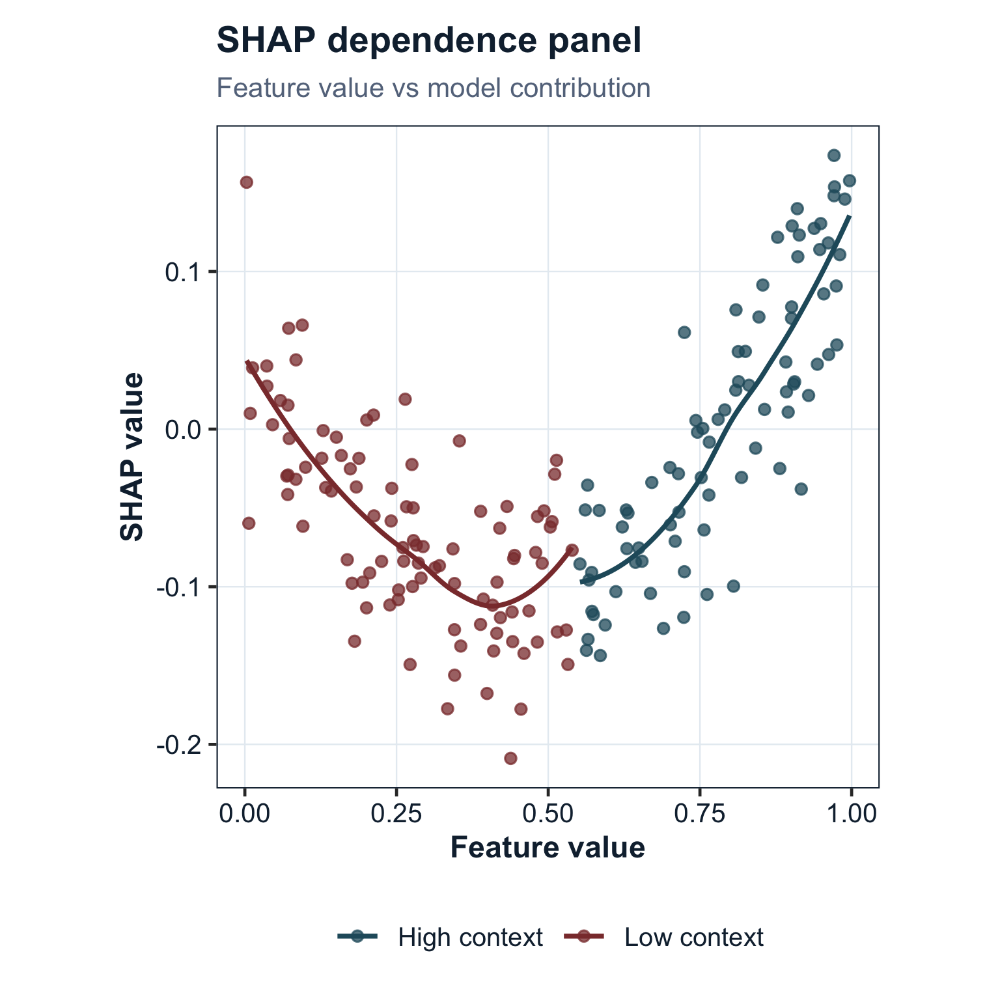

### Representative source files

- `/Users/qihaoning/00工作/202603CTcluster/official_mainline_clean_v1/code/omics_pipeline/joint_binary_manuscript_figures_v2/render_figure4_biology_v2.R` (primary, score=592)
- `/Volumes/七号/课题补充分析和写作/03出图/Figure 7/f7-免疫治疗队列分析.Rmd` (primary, score=435)
- `/Users/qihaoning/00工作/202603CTcluster/code_ref/current_article_templates/Main_Fig5_TIDE_IPS/f7-免疫治疗队列分析.Rmd` (primary, score=435)
- `/Users/qihaoning/00工作/202603CTcluster/official_mainline_clean_v1/code/omics_pipeline/joint_binary_manuscript_figures_v2/render_figure3_v2.R` (primary, score=303)
- `/Volumes/七号/课题补充分析和写作/03出图/Figure 1/f2fgh-多因素分析.Rmd` (primary, score=175)

### Reference code

```r
suppressPackageStartupMessages({library(ggplot2); library(jsonlite)})
args_all <- commandArgs(FALSE)
file_arg <- args_all[grepl("^--file=", args_all)]
this_file <- if (length(file_arg)) sub("^--file=", "", file_arg[[1]]) else normalizePath(".")
template_dir <- dirname(normalizePath(this_file))
shared_theme <- file.path(dirname(template_dir), "_shared", "mas_theme.R")
source(shared_theme)
`%||%` <- function(x, y) if (is.null(x)) y else x
make_example_data <- function() { set.seed(4); x <- runif(180,0,1); data.frame(feature_value=x, shap=.75*(x-.45)^2 - .10 + rnorm(180,0,.045), subgroup=ifelse(x>.55,"High context","Low context")) }
make_plot <- function(data = make_example_data()) { ggplot(data, aes(feature_value, shap, colour=subgroup)) + geom_point(alpha=.75, size=1.5) + geom_smooth(method="loess", formula=y~x, se=FALSE, linewidth=.8) + scale_colour_manual(values=mas_discrete[1:2]) + labs(title="SHAP dependence panel", subtitle="Feature value vs model contribution", x="Feature value", y="SHAP value") + mas_theme() + theme(aspect.ratio=1) }
if (sys.nframe() == 0) save_mas_plot(make_plot(), commandArgs(TRUE)[1] %||% "figures", "shap_dependence_panel", width = 4.8, height = 4.8)

```

## SHAP summary beeswarm

- Template ID: `shap_summary_beeswarm`
- Category: `scatter_correlation` / Scatter / correlation
- med-autoscience mapping: `shap_summary_beeswarm`
- Data contract: `feature`, `shap_value`, `feature_value`
- Axis aspect policy: `square_axis_panel`

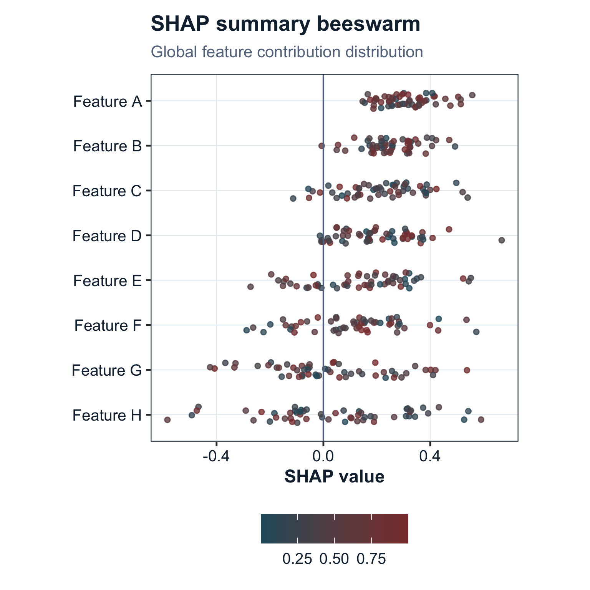

### Representative source files

- `/Users/qihaoning/00工作/202603CTcluster/official_mainline_clean_v1/code/omics_pipeline/joint_binary_manuscript_figures_v2/render_figure4_biology_v2.R` (primary, score=592)
- `/Volumes/七号/课题补充分析和写作/03出图/Figure 7/f7-免疫治疗队列分析.Rmd` (primary, score=435)
- `/Users/qihaoning/00工作/202603CTcluster/code_ref/current_article_templates/Main_Fig5_TIDE_IPS/f7-免疫治疗队列分析.Rmd` (primary, score=435)
- `/Users/qihaoning/00工作/202603CTcluster/official_mainline_clean_v1/code/omics_pipeline/joint_binary_manuscript_figures_v2/render_figure3_v2.R` (primary, score=303)
- `/Volumes/七号/课题补充分析和写作/03出图/Figure 1/f2fgh-多因素分析.Rmd` (primary, score=175)

### Reference code

```r
suppressPackageStartupMessages({library(ggplot2); library(jsonlite)})
args_all <- commandArgs(FALSE)
file_arg <- args_all[grepl("^--file=", args_all)]
this_file <- if (length(file_arg)) sub("^--file=", "", file_arg[[1]]) else normalizePath(".")
template_dir <- dirname(normalizePath(this_file))
shared_theme <- file.path(dirname(template_dir), "_shared", "mas_theme.R")
source(shared_theme)
`%||%` <- function(x, y) if (is.null(x)) y else x
make_example_data <- function() { set.seed(7); features <- paste0("Feature ", LETTERS[1:8]); do.call(rbind, lapply(seq_along(features), function(i) data.frame(feature=features[i], shap=rnorm(55, mean=(9-i)/28, sd=.08+.02*i), value=runif(55)))) }
make_plot <- function(data = make_example_data()) { data$feature <- factor(data$feature, levels=rev(unique(data$feature))); ggplot(data, aes(shap, feature, colour=value)) + geom_point(position=position_jitter(height=.18, width=0), alpha=.78, size=1.15) + geom_vline(xintercept=0, linewidth=.45, colour=mas_palette$muted) + scale_colour_gradient(low=mas_palette$primary, high=mas_palette$secondary) + labs(title="SHAP summary beeswarm", subtitle="Global feature contribution distribution", x="SHAP value", y=NULL, colour="Feature value") + mas_theme() + theme(aspect.ratio=1) }
if (sys.nframe() == 0) save_mas_plot(make_plot(), commandArgs(TRUE)[1] %||% "figures", "shap_summary_beeswarm", width = 4.8, height = 4.8)

```

## SHAP waterfall local explanation

- Template ID: `shap_waterfall_local_explanation_panel`
- Category: `waterfall` / Waterfall / ranked risk score
- med-autoscience mapping: `shap_waterfall_local_explanation_panel`
- Data contract: `feature`, `contribution`, `baseline`, `prediction`
- Axis aspect policy: `free_long_or_composite`

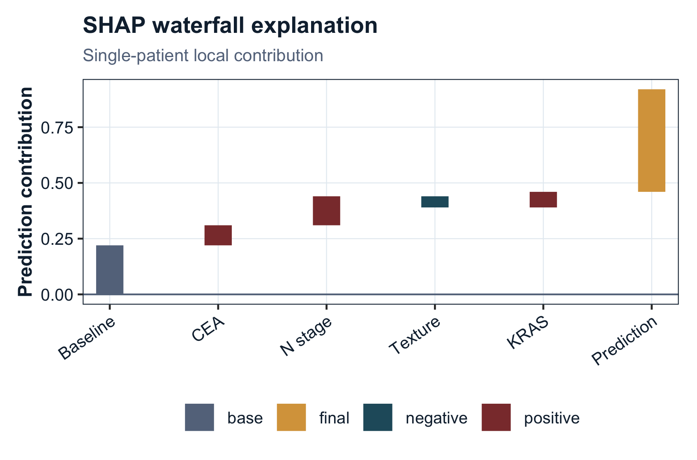

### Representative source files

- `/Volumes/七号/课题补充分析和写作/03出图/Figure 7/f7-免疫治疗队列分析.Rmd` (primary, score=435)
- `/Users/qihaoning/00工作/202603CTcluster/code_ref/current_article_templates/Main_Fig5_TIDE_IPS/f7-免疫治疗队列分析.Rmd` (primary, score=435)
- `/Volumes/七号/课题补充分析和写作/03出图/Figure 5/f5c-生存分析(贝伐使用os).Rmd` (primary, score=314)
- `/Users/qihaoning/00工作/202603CTcluster/ct_cluster_ref/downstream/code/7_mutation_analysis.R` (primary, score=170)
- `/Users/qihaoning/00工作/202603CTcluster/official_mainline_clean_v1/code/omics_pipeline/joint_binary_manuscript_figures_v2/render_figure4_v2.R` (primary, score=157)

### Reference code

```r
suppressPackageStartupMessages({library(ggplot2); library(jsonlite)})
args_all <- commandArgs(FALSE)
file_arg <- args_all[grepl("^--file=", args_all)]
this_file <- if (length(file_arg)) sub("^--file=", "", file_arg[[1]]) else normalizePath(".")
template_dir <- dirname(normalizePath(this_file))
shared_theme <- file.path(dirname(template_dir), "_shared", "mas_theme.R")
source(shared_theme)
`%||%` <- function(x, y) if (is.null(x)) y else x
make_example_data <- function() { data.frame(feature=factor(c("Baseline", "CEA", "N stage", "Texture", "KRAS", "Prediction"), levels=c("Baseline", "CEA", "N stage", "Texture", "KRAS", "Prediction")), contribution=c(.22,.09,.13,-.05,.07,.46), type=c("base","positive","positive","negative","positive","final")) }
make_plot <- function(data = make_example_data()) { data$x <- seq_len(nrow(data)); data$start <- c(0, head(cumsum(data$contribution), -1)); data$end <- cumsum(data$contribution); ggplot(data, aes(x=x)) + geom_segment(aes(xend=x, y=start, yend=end, colour=type), linewidth=7, lineend="butt") + geom_hline(yintercept=0, linewidth=.45, colour=mas_palette$muted) + scale_colour_manual(values=c(base=mas_palette$muted, positive=mas_palette$secondary, negative=mas_palette$primary, final=mas_palette$accent)) + scale_x_continuous(breaks=data$x, labels=data$feature) + labs(title="SHAP waterfall explanation", subtitle="Single-patient local contribution", x=NULL, y="Prediction contribution") + mas_theme() + theme(axis.text.x=element_text(angle=35, hjust=1)) }
if (sys.nframe() == 0) save_mas_plot(make_plot(), commandArgs(TRUE)[1] %||% "figures", "shap_waterfall_local_explanation_panel", width = 5.3, height = 3.5)

```

## Model complexity audit

- Template ID: `model_complexity_audit_panel`
- Category: `scatter_correlation` / Scatter / correlation
- med-autoscience mapping: `model_complexity_audit_panel`
- Data contract: `model`, `feature_count`, `metric`, `validation`
- Axis aspect policy: `square_axis_panel`

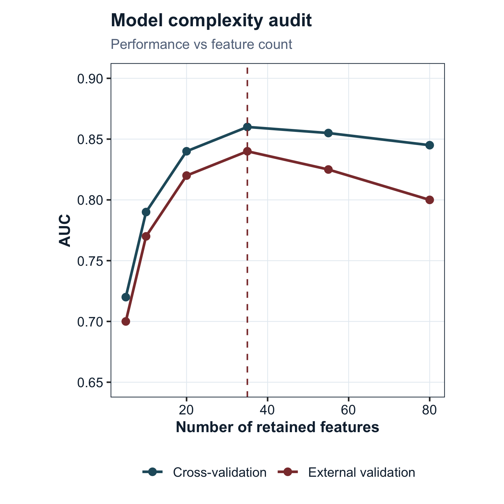

### Representative source files

- `/Users/qihaoning/00工作/202603CTcluster/official_mainline_clean_v1/code/omics_pipeline/joint_binary_manuscript_figures_v2/render_figure4_biology_v2.R` (primary, score=592)
- `/Volumes/七号/课题补充分析和写作/03出图/Figure 7/f7-免疫治疗队列分析.Rmd` (primary, score=435)
- `/Users/qihaoning/00工作/202603CTcluster/code_ref/current_article_templates/Main_Fig5_TIDE_IPS/f7-免疫治疗队列分析.Rmd` (primary, score=435)
- `/Users/qihaoning/00工作/202603CTcluster/official_mainline_clean_v1/code/omics_pipeline/joint_binary_manuscript_figures_v2/render_figure3_v2.R` (primary, score=303)
- `/Volumes/七号/课题补充分析和写作/03出图/Figure 1/f2fgh-多因素分析.Rmd` (primary, score=175)

### Reference code

```r
suppressPackageStartupMessages({library(ggplot2); library(jsonlite)})
args_all <- commandArgs(FALSE)
file_arg <- args_all[grepl("^--file=", args_all)]
this_file <- if (length(file_arg)) sub("^--file=", "", file_arg[[1]]) else normalizePath(".")
template_dir <- dirname(normalizePath(this_file))
shared_theme <- file.path(dirname(template_dir), "_shared", "mas_theme.R")
source(shared_theme)
`%||%` <- function(x, y) if (is.null(x)) y else x
make_example_data <- function() { data.frame(features=c(5,10,20,35,55,80), cv_auc=c(.72,.79,.84,.86,.855,.845), external_auc=c(.70,.77,.82,.84,.825,.80)) }
make_plot <- function(data = make_example_data()) { long <- rbind(data.frame(features=data$features, auc=data$cv_auc, metric="Cross-validation"), data.frame(features=data$features, auc=data$external_auc, metric="External validation")); ggplot(long, aes(features, auc, colour=metric)) + geom_line(linewidth=.85) + geom_point(size=2.1) + geom_vline(xintercept=35, linetype="dashed", colour=mas_palette$secondary, linewidth=.5) + scale_colour_manual(values=mas_discrete[1:2]) + scale_y_continuous(limits=c(.65,.90)) + labs(title="Model complexity audit", subtitle="Performance vs feature count", x="Number of retained features", y="AUC") + mas_theme() + theme(aspect.ratio=1) }
if (sys.nframe() == 0) save_mas_plot(make_plot(), commandArgs(TRUE)[1] %||% "figures", "model_complexity_audit_panel", width = 4.8, height = 4.8)

```

## Cell-type marker dotplot

- Template ID: `celltype_marker_dotplot_panel`
- Category: `heatmap` / Heatmap / matrix pattern
- med-autoscience mapping: `celltype_marker_dotplot_panel`
- Data contract: `cell_type`, `marker`, `pct_expression`, `avg_expression`
- Axis aspect policy: `free_long_or_composite`

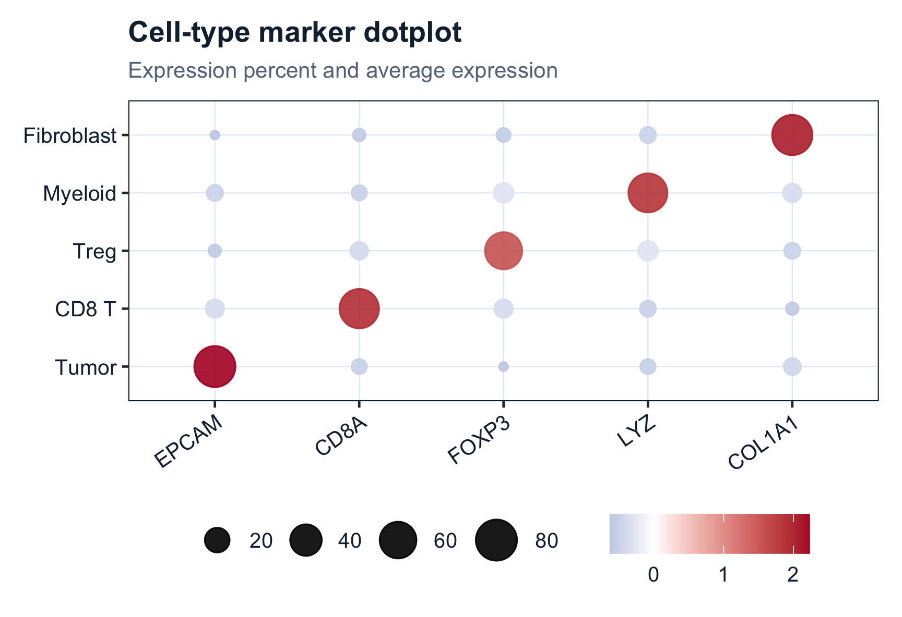

### Representative source files

- `/Users/qihaoning/00工作/202603CTcluster/official_mainline_clean_v1/code/omics_pipeline/joint_binary_manuscript_figures_v2/render_figure4_biology_v2.R` (primary, score=592)
- `/Users/qihaoning/00工作/202603CTcluster/official_mainline_clean_v1/code/omics_pipeline/joint_binary_manuscript_figures_v2/render_figure3_v2.R` (primary, score=303)
- `/Users/qihaoning/00工作/202603CTcluster/official_mainline_clean_v1/code/omics_pipeline/joint_binary_manuscript_figures_v2/render_figure3_features_v2.R` (primary, score=154)
- `/Users/qihaoning/00工作/202603CTcluster/official_mainline_clean_v1/code/omics_pipeline/joint_binary_manuscript_figures_v2/render_figure2_v2.R` (primary, score=128)
- `/Volumes/七号/课题补充分析和写作/03出图/Figure 3/f3c-聚类热图.Rmd` (primary, score=121)

### Reference code

```r
suppressPackageStartupMessages({library(ggplot2); library(jsonlite)})
args_all <- commandArgs(FALSE)
file_arg <- args_all[grepl("^--file=", args_all)]
this_file <- if (length(file_arg)) sub("^--file=", "", file_arg[[1]]) else normalizePath(".")
template_dir <- dirname(normalizePath(this_file))
shared_theme <- file.path(dirname(template_dir), "_shared", "mas_theme.R")
source(shared_theme)
`%||%` <- function(x, y) if (is.null(x)) y else x
make_example_data <- function() { cells <- c("Tumor", "CD8 T", "Treg", "Myeloid", "Fibroblast"); markers <- c("EPCAM", "CD8A", "FOXP3", "LYZ", "COL1A1"); d <- expand.grid(cell_type=cells, marker=markers); d$pct <- c(80,8,2,5,1, 4,72,7,4,2, 1,8,62,10,3, 4,5,10,70,5, 6,2,5,8,76); d$avg <- as.numeric(scale(d$pct)); d }
make_plot <- function(data = make_example_data()) { ggplot(data, aes(marker, cell_type, size=pct, colour=avg)) + geom_point(alpha=.9) + scale_colour_gradient2(low=mas_palette$blue, mid="white", high=mas_palette$red) + scale_size(range=c(1.5,8)) + labs(title="Cell-type marker dotplot", subtitle="Expression percent and average expression", x=NULL, y=NULL, size="Pct", colour="Avg exp") + mas_theme() + theme(axis.text.x=element_text(angle=35, hjust=1)) }
if (sys.nframe() == 0) save_mas_plot(make_plot(), commandArgs(TRUE)[1] %||% "figures", "celltype_marker_dotplot_panel", width = 5.4, height = 3.7)

```

## Subtype transition alluvial

- Template ID: `sankey_alluvial`
- Category: `sankey_alluvial` / Sankey / alluvial flow
- med-autoscience mapping: `atlas_spatial_trajectory_storyboard_panel`
- Data contract: `left_group`, `right_group`, `n`
- Axis aspect policy: `free_long_or_composite`

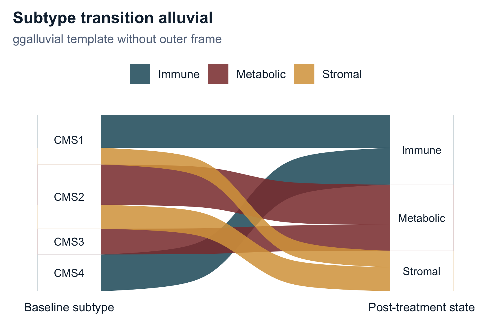

### Representative source files

- `/Users/qihaoning/00工作/202603CTcluster/official_mainline_clean_v1/code/omics_pipeline/joint_binary_manuscript_figures_v2/render_figure4_biology_v2.R` (primary, score=592)
- `/Users/qihaoning/00工作/202603CTcluster/official_mainline_clean_v1/code/omics_pipeline/joint_binary_manuscript_figures_v2/render_figure3_v2.R` (primary, score=303)
- `/Users/qihaoning/00工作/202603CTcluster/official_mainline_clean_v1/code/omics_pipeline/joint_binary_manuscript_figures_v2/stage_figure4_biology_v2.py` (primary, score=177)
- `/Users/qihaoning/00工作/202603CTcluster/official_mainline_clean_v1/code/omics_pipeline/joint_binary_manuscript_figures_v2/stage_figure3_v2.py` (primary, score=93)
- `/Users/qihaoning/00工作/202603CTcluster/ct_cluster_ref/downstream/code/2_sankey_cms.R` (primary, score=19)

### Reference code

```r
suppressPackageStartupMessages({library(ggplot2); library(jsonlite)})
args_all <- commandArgs(FALSE)
file_arg <- args_all[grepl("^--file=", args_all)]
this_file <- if (length(file_arg)) sub("^--file=", "", file_arg[[1]]) else normalizePath(".")
template_dir <- dirname(normalizePath(this_file))
shared_theme <- file.path(dirname(template_dir), "_shared", "mas_theme.R")
source(shared_theme)
`%||%` <- function(x, y) if (is.null(x)) y else x
make_example_data <- function() {
  data.frame(
    left_group = c("CMS1", "CMS1", "CMS2", "CMS2", "CMS3", "CMS4"),
    right_group = c("Immune", "Stromal", "Metabolic", "Stromal", "Metabolic", "Immune"),
    n = c(18, 9, 22, 13, 14, 20)
  )
}
make_plot <- function(data = make_example_data()) {
  ggplot(data, aes(axis1 = left_group, axis2 = right_group, y = n)) +
    ggalluvial::geom_alluvium(aes(fill = right_group), width = 0.18, alpha = 0.86, knot.pos = 0.42) +
    ggalluvial::geom_stratum(width = 0.18, fill = "white", colour = NA, linewidth = 0) +
    ggalluvial::stat_stratum(geom = "text", aes(label = after_stat(stratum)), size = 3.0, colour = mas_palette$neutral) +
    scale_fill_manual(values = mas_discrete[1:3]) +
    scale_x_discrete(limits = c("Baseline subtype", "Post-treatment state"), expand = c(0.08, 0.08)) +
    labs(title = "Subtype transition alluvial", subtitle = "ggalluvial template without outer frame", x = NULL, y = NULL) +
    mas_theme() +
    theme(
      legend.position = "top",
      panel.grid.major = element_blank(),
      panel.grid.minor = element_blank(),
      panel.border = element_blank(),
      axis.line = element_blank(),
      axis.text.y = element_blank(),
      axis.ticks = element_blank(),
      axis.title.y = element_blank()
    )
}
if (sys.nframe() == 0) save_mas_plot(make_plot(), commandArgs(TRUE)[1] %||% "figures", "sankey_alluvial", width = 5.3, height = 3.5)

```

## Radial immune/pathology profile

- Template ID: `radar`
- Category: `radar` / Radar / radial profile
- med-autoscience mapping: `practical_factor_dot_figure`
- Data contract: `group`, `axis_scores`
- Axis aspect policy: `free_long_or_composite`

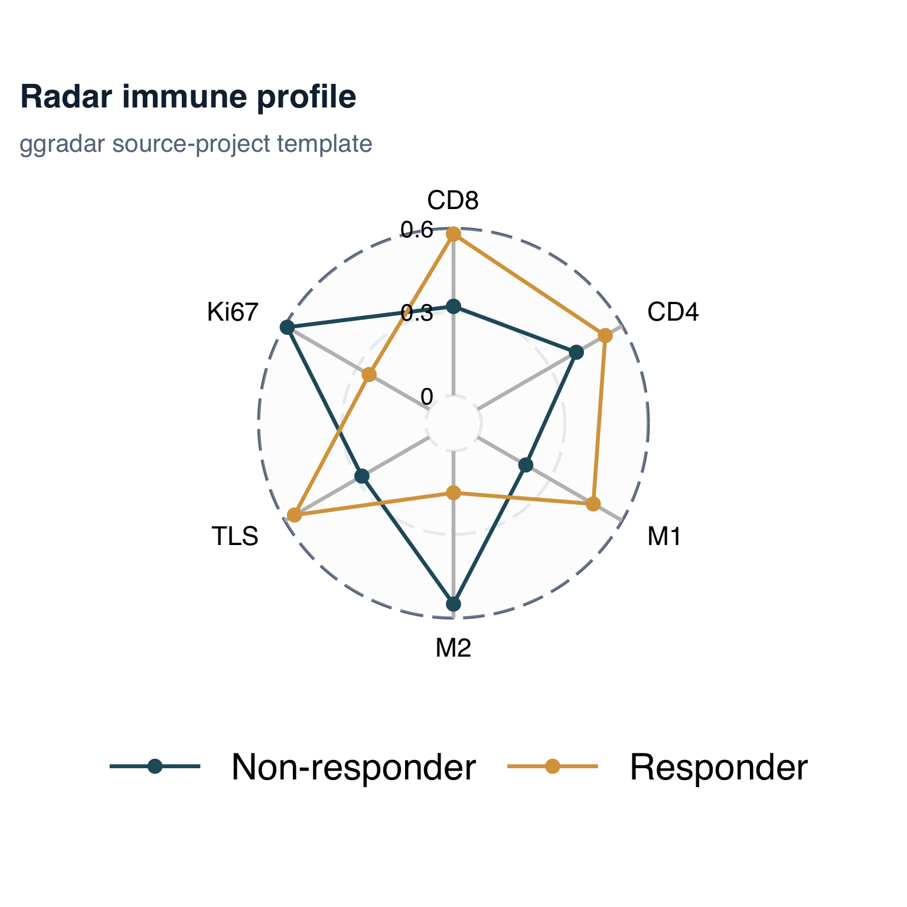

### Representative source files

- `/Volumes/七号/课题补充分析和写作/03出图/Figure 6/f6c-HE细胞计数雷达图.Rmd` (primary, score=33)
- `/Users/qihaoning/00工作/202603CTcluster/code_ref/03出图_Rmd_code/Figure 6/f6c-HE细胞计数雷达图.Rmd` (reference, score=33)

### Reference code

```r
suppressPackageStartupMessages({library(ggplot2); library(jsonlite)})
args_all <- commandArgs(FALSE)
file_arg <- args_all[grepl("^--file=", args_all)]
this_file <- if (length(file_arg)) sub("^--file=", "", file_arg[[1]]) else normalizePath(".")
template_dir <- dirname(normalizePath(this_file))
shared_theme <- file.path(dirname(template_dir), "_shared", "mas_theme.R")
source(shared_theme)
`%||%` <- function(x, y) if (is.null(x)) y else x
make_example_data <- function() {
  data.frame(
    group = c("Responder", "Non-responder"),
    CD8 = c(.68, .42), CD4 = c(.63, .51), M1 = c(.58, .30), M2 = c(.25, .65), TLS = c(.66, .38), Ki67 = c(.35, .69)
  )
}
make_plot <- function(data = make_example_data()) {
  if (requireNamespace("ggradar", quietly = TRUE)) {
    p <- ggradar::ggradar(
      data,
      centre.y = 0,
      grid.min = 0.1,
      grid.mid = 0.4,
      grid.max = 0.7,
      values.radar = c(0, 0.3, 0.6),
      background.circle.colour = "grey95",
      gridline.max.colour = mas_palette$muted,
      gridline.min.colour = mas_palette$soft_grid,
      gridline.mid.colour = mas_palette$soft_grid,
      grid.label.size = 4,
      grid.line.width = 0.55,
      axis.label.offset = 1.15,
      axis.label.size = 3.5,
      group.line.width = 0.7,
      group.point.size = 1.8,
      group.colours = c(mas_palette$primary, mas_palette$accent),
      legend.position = "bottom",
      plot.extent.x.sf = 1.35,
      plot.extent.y.sf = 1.15
    )
    p$labels$size <- NULL
    p +
      labs(title = "Radar immune profile", subtitle = "ggradar source-project template") +
      theme(
        panel.border = element_blank(),
        plot.title = element_text(size = 12.5, face = "bold", colour = mas_palette$neutral),
        plot.subtitle = element_text(size = 9.5, colour = mas_palette$muted)
      )
  } else {
    long <- tidyr::pivot_longer(data, -group, names_to = "axis", values_to = "score")
    long$axis <- factor(long$axis, levels = names(data)[-1])
    ggplot(long, aes(axis, score, group = group, colour = group, fill = group)) +
      geom_polygon(alpha = .10, linewidth = .65) +
      geom_point(size = 1.6) +
      # Fallback intentionally stays non-polar so the source-project ggradar path
      # remains the only radar implementation contract.
      coord_cartesian(ylim = c(0, 1), expand = FALSE) +
      scale_y_continuous(limits = c(0, 1), breaks = c(.25, .5, .75, 1)) +
      scale_colour_manual(values = mas_discrete[1:2]) +
      scale_fill_manual(values = mas_discrete[1:2]) +
      labs(title = "Radar immune profile", subtitle = "Install ggradar for source-project rendering", x = NULL, y = NULL) +
      mas_theme() +
      theme(panel.border = element_blank(), panel.grid.major = element_line(colour = mas_palette$soft_grid, linewidth = .35))
  }
}
if (sys.nframe() == 0) save_mas_plot(make_plot(), commandArgs(TRUE)[1] %||% "figures", "radar", width = 4.8, height = 4.8)

```

## Baseline summary table

- Template ID: `baseline_table`
- Category: `baseline_table` / Baseline / summary table
- med-autoscience mapping: `table1_baseline_characteristics`
- Data contract: `variable`, `level`, `overall`, `group_a`, `group_b`, `p_value`
- Axis aspect policy: `free_long_or_composite`

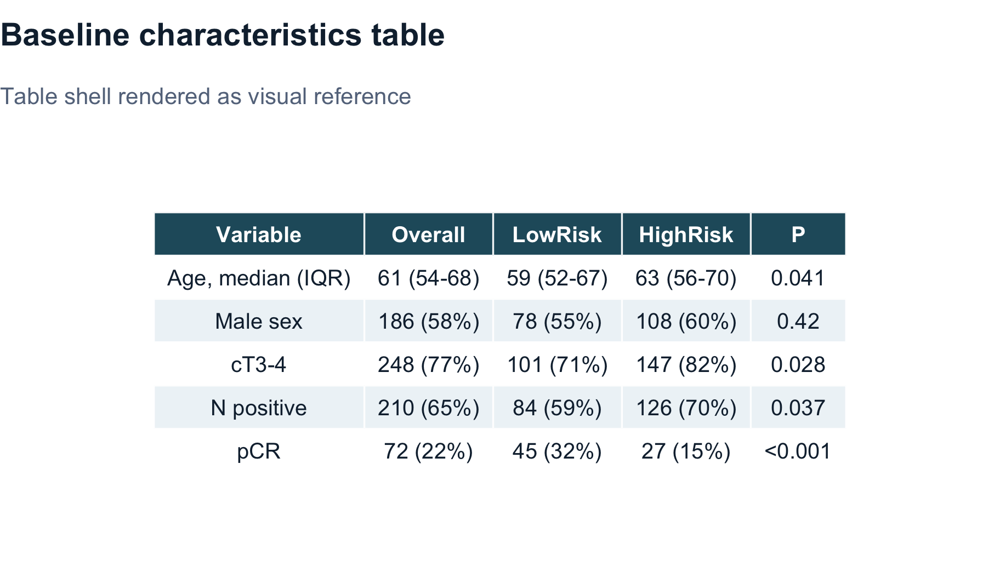

### Representative source files

- `/Volumes/七号/课题补充分析和写作/03出图/Figure 7/f7-免疫治疗队列分析.Rmd` (primary, score=435)
- `/Users/qihaoning/00工作/202603CTcluster/code_ref/current_article_templates/Main_Fig5_TIDE_IPS/f7-免疫治疗队列分析.Rmd` (primary, score=435)
- `/Volumes/七号/课题补充分析和写作/03出图/Figure 4/f4ghi-生存曲线.Rmd` (primary, score=340)
- `/Volumes/七号/课题补充分析和写作/03出图/Figure 5/f5c-生存分析(贝伐使用os).Rmd` (primary, score=314)
- `/Volumes/七号/课题补充分析和写作/03出图/Figure 3/f3a-tcga突变图谱图.Rmd` (primary, score=235)

### Reference code

```r
suppressPackageStartupMessages({library(ggplot2); library(gridExtra); library(grid); library(jsonlite)})
args_all <- commandArgs(FALSE)
file_arg <- args_all[grepl("^--file=", args_all)]
this_file <- if (length(file_arg)) sub("^--file=", "", file_arg[[1]]) else normalizePath(".")
template_dir <- dirname(normalizePath(this_file))
shared_theme <- file.path(dirname(template_dir), "_shared", "mas_theme.R")
source(shared_theme)
`%||%` <- function(x, y) if (is.null(x)) y else x
make_example_data <- function() { data.frame(Variable = c("Age, median (IQR)", "Male sex", "cT3-4", "N positive", "pCR"), Overall = c("61 (54-68)", "186 (58%)", "248 (77%)", "210 (65%)", "72 (22%)"), LowRisk = c("59 (52-67)", "78 (55%)", "101 (71%)", "84 (59%)", "45 (32%)"), HighRisk = c("63 (56-70)", "108 (60%)", "147 (82%)", "126 (70%)", "27 (15%)"), P = c("0.041", "0.42", "0.028", "0.037", "<0.001")) }
make_plot <- function(data = make_example_data()) { tg <- gridExtra::tableGrob(data, rows = NULL, theme = gridExtra::ttheme_minimal(base_size = 9, core = list(fg_params = list(col = mas_palette$neutral), bg_params = list(fill = c("white", mas_palette$light), col = "white")), colhead = list(fg_params = list(fontface = "bold", col = "white"), bg_params = list(fill = mas_palette$primary, col = "white")))); title <- grid::textGrob("Baseline characteristics table", x = 0, hjust = 0, gp = grid::gpar(fontface = "bold", fontsize = 13, col = mas_palette$neutral)); subtitle <- grid::textGrob("Table shell rendered as visual reference", x = 0, hjust = 0, gp = grid::gpar(fontsize = 9.5, col = mas_palette$muted)); gridExtra::arrangeGrob(title, subtitle, tg, heights = c(.12,.10,.78)) }
if (sys.nframe() == 0) save_mas_plot(make_plot(), commandArgs(TRUE)[1] %||% "figures", "baseline_table", width = 5.7, height = 3.2)

```
